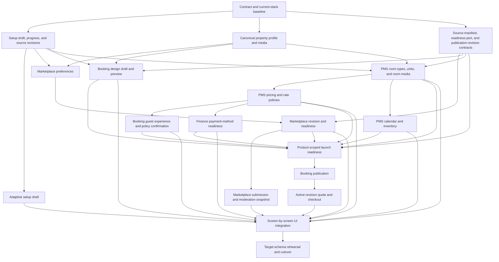

# Hotel Onboarding Information Inventory

_Current V1 product-decision, adaptive-flow, and implementation-plan record.
All active screen blueprints and dependency slices are drafted; contract
implementation and product UI remain pending._

## Purpose

Before redesigning the guided hotel onboarding, separate two decisions:

1. **What information does Vayada genuinely need from the hotel?**
2. **At which point in the flow should Vayada ask for it?**

The domain inventory answers the first question. The adaptive-flow section at
the end answers the second without creating a separate competing document. The
document reconciles:

- what the preserved initial onboarding asks and what the retired post-contact
  flow used to ask;
- what the target TypeScript/PostgreSQL stack can persist;
- what hotel owners can view or edit later in Marketplace, Booking Admin, and
  PMS;
- fields that appear in legacy or transitional UI but are not supported by the
  target write path.

The hotel-supplied field inventory deliberately excludes internal IDs, audit
metadata, migration fields, readiness states, counters, and operational
transaction data. Readiness behavior is documented separately because it
controls publication but is not information entered by the hotel.

## Scope Boundary

The initial flow keeps its existing three-part structure:

1. product selection;
2. hotel identity and location;
3. contact information.

The hotel logo belongs in the initial “About your hotel” part of that flow. It
is collected there once and is not requested again after contact information.

### Account and hotel image decision

- Creator accounts must provide a personal profile photo.
- Hotel-manager accounts do not provide a personal profile photo during
  account setup.
- Each hotel provides one property-owned logo in “About your hotel.”
- Hotel-facing navigation, chat, and Marketplace use the currently selected
  hotel’s logo.
- Personal account menus represent hotel managers with their initials.
- A hotel logo must not be copied into `identity.user.profile_image`; it remains
  attached to the hotel so multiple managers and multi-hotel groups share the
  correct property identity.

The replacement onboarding will begin after the owner saves the contact information
page.

The retired nine-step onboarding implementation is being replaced rather than
incrementally restored. Its former grouping, validation, and save behavior are
not constraints for the redesign.

The discarded post-contact form renderer and its task-specific frontend
adapters have been removed. Until the replacement is designed, the preserved
initial flow ends after the contact information is saved.

The available product selections remain:

- Creator Marketplace;
- Hotel Operations, which includes Booking Engine and PMS;
- both.

## Source-of-Truth Decision

The redesign uses this precedence:

1. **Target database schemas and target API contracts** define what the system
   can safely persist and use.
2. **This approved information inventory** defines which supported fields the
   product actually wants to collect, derive, generate, or defer.
3. **The adaptive-flow section in this document** defines grouping, order,
   requiredness, conditional behavior, and launch rules.
4. Existing profile and settings screens are evidence of product needs, but
   they are not automatically authoritative.
5. The retired nine-step forms and their Git history are reference material
   only. Fields, groupings, and validation must not be copied from them unless
   they survive this inventory review.

If a desired field has no target persistence contract, it must be marked as a
product gap and designed in the backend before it appears in the new
onboarding. If the database supports a field but the product does not need it
during first setup, it remains a later setting.

## Audit Legend

### Product status

| Status                         | Meaning                                                              |
| ------------------------------ | -------------------------------------------------------------------- |
| Required                       | Needed before the relevant product can be launched                   |
| Required review                | The owner must review/confirm the section; selections may be empty   |
| Recommended                    | Valuable during setup but should not prevent launch                  |
| Optional                       | May be skipped without reducing core readiness                       |
| Conditional                    | Required only after another feature or option has been selected      |
| Derived/generated              | Produced from canonical data or defaults instead of being re-entered |
| Optional later                 | Intentionally configured after initial launch                        |
| Required before PMS operations | Does not block Booking launch but gates operational PMS use          |
| Gap                            | Desired behavior is not fully supported by the target stack          |
| Future                         | Intentionally excluded from V1 and reconsidered later                |

### Evidence status

| Marker               | Meaning                                                               |
| -------------------- | --------------------------------------------------------------------- |
| Asked now            | A current onboarding form asks for it                                 |
| Asked before removal | The retired post-contact onboarding asked for it                      |
| Stored               | The target database and API have a supported destination              |
| Editable later       | A post-onboarding product surface exposes it                          |
| Read-only later      | A later surface displays the canonical value but does not own it      |
| Legacy/unsupported   | UI or old models mention it, but the target write path cannot save it |
| Missing from setup   | Supported later or in storage, but absent from onboarding             |

## Audit Conclusions

1. The existing first-run flow asks only for canonical hotel identity,
   address, timezone, and three contact channels. It does **not** ask for a
   separate house number.
2. Shared hotel content belongs to Hotel Catalog. Marketplace should not own a
   duplicate hotel listing or duplicate public description.
3. Marketplace onboarding stores only hotel-level collaboration preferences.
   Exact dates, deliverables, quantities, compensation, usage rights, and other
   terms belong to the individual collaboration after chat.
4. Marketplace has no offer-owned media. It reuses the canonical Hotel Catalog
   cover and gallery.
5. Booking Admin contains substantial configuration absent from onboarding:
   room filters, add-ons, benefits, localization, guest-form behavior,
   last-minute discounts, and promo codes.
6. Several fields shown in retired or transitional setup forms are false affordances on the
   target stack. Examples include raw payout bank fields and some guest-policy
   controls that the save function ignores.
7. Hotel Operations onboarding includes enough pricing flexibility to launch:
   a standard price, simple seasons, weekend pricing, additional-guest pricing,
   a required flexible/refundable baseline, and an optional non-refundable rate
   derived as a discount from that baseline. One-off date overrides,
   partial-refund tiers, meal plans, booking lead time, maximum stay, and
   closed-to-arrival/departure rules remain later PMS configuration.
8. Not every supported setting belongs in first-run onboarding. Domains,
   notifications, billing preferences, operational checklists, physical room
   assignment, and the advanced rate rules listed above are post-launch
   settings.
9. Language has three separate scopes: each employee's application interface,
   the guest-facing Booking Engine interface, and translated hotel content.
   They must not share one ambiguous hotel-level locale field.
10. V1 does not calculate separate taxes, mandatory fees, deposits, or
    multi-tier refund entitlements. The hotel supplies the final guest-facing
    price, Vayada calculates its commission, the displayed cancellation policy
    determines refund entitlement, and the hotel manually executes the refund
    and remains responsible for taxes and invoicing.
11. Direct-booking growth tools do not belong in onboarding. The basic Booking
    Engine is published first; benefits, add-ons, promo codes, and last-minute
    pricing are introduced afterward through a persistent checklist.

## A. Information Collected in the Initial Flow

These fields must not be requested again in the redesigned flow.

| Field ID                      | Information                               | Initial form     | Target storage                            | Later surfaces                          | Product status              |
| ----------------------------- | ----------------------------------------- | ---------------- | ----------------------------------------- | --------------------------------------- | --------------------------- |
| `hotel.display_name`          | Hotel display name                        | Asked now        | Stored                                    | Marketplace, Booking, PMS               | Required                    |
| `hotel.property_type`         | Property type                             | Asked now        | Stored                                    | Marketplace/PMS read models             | Required                    |
| `profile.logo`                | Hotel logo                                | Planned addition | Schema/purpose only; usable write missing | Navigation, chat, Marketplace, Booking  | Required; API/policy/UI gap |
| `hotel.street_address`        | Full street address                       | Asked now        | Stored                                    | Booking settings, read-only elsewhere   | Required                    |
| `hotel.postal_code`           | Postal code                               | Asked now        | Stored                                    | Canonical profile                       | Required                    |
| `hotel.city`                  | City                                      | Asked now        | Stored                                    | Marketplace, Booking, PMS               | Required                    |
| `hotel.country_code`          | ISO country code                          | Asked now        | Stored                                    | Marketplace, Booking, PMS               | Required                    |
| `hotel.locality_public`       | Consent to show city and country publicly | Planned addition | Canonical location visibility             | Marketplace and Booking public profiles | Required for public launch  |
| `hotel.latitude`              | Map latitude                              | Captured         | Stored                                    | Location/map consumers                  | Required                    |
| `hotel.longitude`             | Map longitude                             | Captured         | Stored                                    | Location/map consumers                  | Required                    |
| `hotel.timezone`              | IANA timezone                             | Asked now        | Stored                                    | PMS settings                            | Required                    |
| `hotel.contact_email`         | Guest-facing hotel/reception email        | Asked now        | Stored                                    | Booking Contact menu and settings       | Required                    |
| `hotel.contact_phone`         | Guest-facing hotel/reception phone        | Asked now        | Stored                                    | Booking Contact menu and settings       | Required                    |
| `contact.whatsapp`            | Guest-facing WhatsApp number              | Asked now        | Stored                                    | Booking Contact menu and settings       | Optional                    |
| `organization.selected_track` | Marketplace, Operations, or both          | Asked now        | Setup intent                              | Drives adaptive onboarding              | Required                    |

Canonical contact storage additionally supports website, Instagram, Facebook,
and X, plus contact purpose and public/private visibility. The initial form
publishes phone, optional WhatsApp, and email after explaining that guests can
see them.

### Language ownership decision

#### Employee interface language

The language used by PMS, Booking Admin, and Marketplace belongs to the
individual employee—not to the hotel or Booking Engine.

| Field ID                | Information                              | Prior evidence            | Target storage                  | Onboarding treatment                              | Product status |
| ----------------------- | ---------------------------------------- | ------------------------- | ------------------------------- | ------------------------------------------------- | -------------- |
| `user.interface_locale` | Employee's hotel-facing interface locale | Derived from browser only | Missing per-user locale storage | Preselect from browser; expose a compact switcher | Gap            |

- Do not add a required onboarding question or a separate interface-language
  step.
- Preselect the language from the employee's browser.
- Expose a small language switcher during setup and allow later changes in
  personal settings.
- Persist an explicit change per user so employees at the same hotel can use
  different interface languages.
- Only show languages that PMS, Booking Admin, and Marketplace actually
  support.
- The current database has no persisted per-user locale destination. Add the
  backend contract before treating a language change as saved.

#### Guest booking languages

Guest booking languages belong to Booking Engine configuration and therefore
only apply when Hotel Operations is selected.

- Ask for one default guest-facing language during Booking Engine onboarding;
  it is required.
- Additional guest-facing languages are optional.
- Offer an additional language only when both the public booking interface and
  the relevant hotel content can support it.
- Marketplace-only onboarding asks no guest-booking language questions.

The corresponding fields are inventoried under
[Guest Booking Experience](#g-guest-booking-experience).

#### Translated hotel content

Translated hotel descriptions, policies, and other public content are a
separate future concern. Do not infer content translations from either an
employee's interface language or the Booking Engine's selectable languages.
V1 persists one explicit `profile.default_locale` for the canonical summary.
Step 1 asks which supported language the owner is writing, stores the summary
under that locale, and labels the field accordingly. It never infers content
language from the employee's browser or the later guest-interface choice.
`profile.supported_locales` and additional translated content remain part of
the future translation design.

## B. Shared Hotel Presentation

Hotel Catalog is the canonical owner. Marketplace and Booking consume these
values.

| Field ID                    | Information                          | Prior evidence                  | Target storage | Later surfaces                    | Product status                             |
| --------------------------- | ------------------------------------ | ------------------------------- | -------------- | --------------------------------- | ------------------------------------------ |
| `profile.short_description` | Canonical public hotel summary       | Not asked                       | Stored         | Marketplace and Booking Engine    | Required                                   |
| `profile.hero_image`        | Main public hotel image              | Asked before removal indirectly | Stored         | Marketplace and Booking consumers | Recommended                                |
| `profile.gallery_images`    | Additional public hotel images       | Asked before removal partially  | Stored         | Public profile                    | Recommended; Marketplace upload-policy gap |
| `profile.media_alt_text`    | Accessible description per image     | Generated                       | Stored         | Public profile                    | Derived/generated                          |
| `profile.amenities`         | Hotel-level facilities and amenities | Not asked                       | Stored         | Public profile                    | Recommended; API gap                       |

`hotel.property_type`, collected in the initial flow, is the only hotel
classification field. The redesign does not ask for a separate category or
star rating. If Vayada later needs descriptors such as boutique, luxury, or
family-friendly, they should be optional discovery tags rather than another
category field.

Do not introduce another generic “creator-facing introduction.” Marketplace
has separate fields for collaboration context, but the hotel description itself
should remain canonical.

The replacement asks for one concise hotel summary only. It does not ask for a
separate full description.

### Media reuse decision

The hotel uploads each photo once into one shared hotel media library. Product
surfaces reference those existing media objects instead of asking for separate
copies.

| Media role                | Customer-facing use                                            | Onboarding behavior                                      |
| ------------------------- | -------------------------------------------------------------- | -------------------------------------------------------- |
| Hotel cover               | First image on the Marketplace profile and public booking page | Select one uploaded hotel photo                          |
| Hotel gallery             | Hotel gallery on Marketplace and the public booking page       | Select any additional uploaded hotel photos              |
| Room photos               | Booking room cards, room details, and room-selection galleries | Assign existing photos to room types; new upload allowed |
| Marketplace profile media | Hotel cards and hotel details in Marketplace discovery         | Reuse the hotel cover/gallery; no separate upload        |

The cover and gallery are optional but strongly encouraged. Every published
room type must have at least one assigned photo before the Booking Engine can
be published; three to five are recommended. The hotel may reuse shared media
or upload room-specific media. The first version does not ask for a separate
Marketplace upload.

### Additional contact and discoverability fields

| Field ID                | Information               | Prior evidence | Target storage | Later surfaces    | Product status      |
| ----------------------- | ------------------------- | -------------- | -------------- | ----------------- | ------------------- |
| `contact.instagram`     | Instagram profile         | Not asked      | Stored         | Booking settings  | Optional later      |
| `contact.facebook`      | Facebook profile          | Not asked      | Stored         | Booking settings  | Optional later      |
| `contact.x`             | X profile                 | Not asked      | Stored         | No current editor | Optional later      |
| `profile.public_slug`   | Generated public URL slug | Generated      | Stored         | Public URLs       | Required, generated |
| `profile.custom_domain` | Verified custom hostname  | Not asked      | Stored         | Booking settings  | Optional later      |

TikTok and YouTube appear in transitional Booking settings, but the target
profile write path explicitly does not support them.

## C. Creator Marketplace

Only relevant when Creator Marketplace is selected.

### Marketplace onboarding decision

Selecting Creator Marketplace already means the hotel accepts creator
collaborations. The onboarding does not ask for that confirmation again and
does not create a public offer or campaign.

It collects only these general hotel-level preferences:

| Field ID                                     | Information                                       | Requirement |
| -------------------------------------------- | ------------------------------------------------- | ----------- |
| `marketplace.preferences.compensation_types` | Free stay, payment, discount, or commission       | Required    |
| `marketplace.preferences.content_platforms`  | Platforms the hotel is interested in              | Required    |
| `marketplace.preferences.content_types`      | Reels, Stories, posts, photos, videos, etc.       | Required    |
| `marketplace.preferences.availability`       | Year-round or selected generally available months | Required    |

The approved target model stores these values once per Marketplace hotel
profile. Onboarding must use the hotel-level preferences contract and must not
create a fake offer.

Specific stay dates, exact deliverables, quantities, deadlines, compensation,
usage rights, and special requirements are negotiated in chat and confirmed
per collaboration.

### Later Marketplace profile settings

| Field ID                               | Information                              | Prior evidence             | Target storage | Later surfaces           | Product status                       |
| -------------------------------------- | ---------------------------------------- | -------------------------- | -------------- | ------------------------ | ------------------------------------ |
| `marketplace.host_summary`             | Why the hotel wants creator partnerships | Conflated with description | Stored         | Marketplace profile      | Optional later; self-service API gap |
| `marketplace.collaboration_guidelines` | General rules across collaborations      | Not asked                  | Stored         | Limited current exposure | Optional later; self-service API gap |

Neither field belongs in first-run onboarding. The canonical hotel summary
already introduces the property; any later partnership context must not become
a second generic hotel description.

### Explicitly excluded legacy offer fields

The deleted offer model is not an onboarding or persistence source. Do not ask
for an offer title, offer summary, offer images, campaign dates, stay length,
maximum payment, currency, discount or commission percentage, minimum follower
count, included perks, or other offer terms.

General availability and acceptable compensation types now live in the
hotel-level preferences above. Everything specific to one partnership is
negotiated in chat and saved on the collaboration.

### Exact deliverable fields for confirmed collaboration terms

| Field ID                      | Information                         | Prior evidence               | Target storage          | Later surfaces      | Product status          |
| ----------------------------- | ----------------------------------- | ---------------------------- | ----------------------- | ------------------- | ----------------------- |
| `deliverable.platform`        | Platform where content is published | Asked before removal broadly | Confirmed collaboration | Collaboration terms | Required when agreed    |
| `deliverable.type`            | Reel, post, story, video, etc.      | Not asked explicitly         | Confirmed collaboration | Collaboration terms | Required when agreed    |
| `deliverable.quantity`        | Number of each deliverable          | Not asked                    | Confirmed collaboration | Collaboration terms | Required when agreed    |
| `deliverable.timing_guidance` | When content should be delivered    | Not asked                    | Confirmed collaboration | Collaboration terms | Recommended when agreed |

The replacement onboarding does not ask for exact quantities or timing. Those
values belong only to confirmed collaboration terms after chat. A future
campaign product would require a separate model and product decision rather
than restoring the deleted offer fields.

### Creator fit exclusions

The onboarding asks which content platforms interest the hotel. It does not ask
for creator niches, follower minimums, audience countries, or audience age
ranges.

## D. Rooms and Physical Inventory

Only relevant when Hotel Operations is selected. Room-type fields repeat.

| Field ID              | Information                            | Prior evidence       | Target storage                             | PMS later surfaces         | Product status                             |
| --------------------- | -------------------------------------- | -------------------- | ------------------------------------------ | -------------------------- | ------------------------------------------ |
| `room.name`           | Public room-type name                  | Asked before removal | Stored                                     | Room management            | Required                                   |
| `room.category`       | Room category                          | Asked before removal | Stored                                     | Room management            | Recommended                                |
| `room.unit_count`     | Number of bookable physical units      | Asked before removal | Derivable/stored as rooms                  | Room management            | Required                                   |
| `room.max_occupancy`  | Maximum total guests                   | Asked before removal | Stored in occupancy limits                 | Room management            | Required                                   |
| `room.max_adults`     | Maximum adults                         | Asked before removal | Stored                                     | Room management            | Derived by default; optional override      |
| `room.max_children`   | Maximum children                       | Asked before removal | Stored                                     | Room management            | Derived by default; optional override      |
| `room.beds`           | Bed types and quantities               | Asked before removal | Stored in attributes                       | Room management            | Required; API gap                          |
| `room.bedrooms`       | Number of bedrooms                     | Asked before removal | Stored in attributes                       | Room management            | Recommended                                |
| `room.bathrooms`      | Number of bathrooms                    | Asked before removal | Stored in attributes                       | Room management            | Recommended                                |
| `room.bathroom_type`  | Private or shared bathroom             | Missing              | Attribute contract gap                     | Room management            | Required; Gap                              |
| `room.size`           | Room size                              | Asked before removal | Stored in attributes                       | Room management            | Recommended                                |
| `room.description`    | Guest-facing room description          | Asked before removal | Stored                                     | Room management            | Recommended                                |
| `room.features`       | Room highlights/features               | Asked before removal | No explicit target contract                | No reliable target surface | Excluded from V1 onboarding                |
| `room.amenities`      | Room amenities                         | Asked before removal | Stored snapshot                            | Room management            | Required review; acknowledgment gap        |
| `room.images`         | Shared hotel-media assignments         | Asked before removal | Canonical media references; PMS projection | Room and booking galleries | Required for Booking launch; readiness gap |
| `room.number`         | Individual physical room label/number  | Not asked            | Stored                                     | PMS room inventory         | Required before PMS operations             |
| `room.floor`          | Floor per physical room                | Not asked            | Stored                                     | PMS room inventory         | Optional later                             |
| `room.initial_status` | Available, occupied, maintenance, etc. | Not asked            | Stored                                     | PMS room inventory         | Optional later                             |

The primary onboarding asks only for `room.unit_count`. Vayada automatically
creates that number of physical room records for the room type. A later bulk
PMS task lets the hotel replace generated placeholders with its actual room
labels or numbers.

Unique room labels are required before the hotel can use room assignment,
housekeeping, or check-in operations. They do not block publishing the Booking
Engine. Floor assignments remain optional because many supported property
types do not use meaningful floors.

The room-amenities section must be reviewed, but the hotel may confirm that no
additional amenities apply. Beds, occupancy, and bathroom type are explicit
room facts rather than optional amenity selections.

When the owner does not set separate adult and child limits, both limits derive
from `room.max_occupancy`; the total occupancy cap still applies. This prevents
an otherwise complete room from becoming invisible to normal adult searches
because a missing adult limit was projected as zero. A later child-policy choice
controls whether the Booking Engine offers child selection at all.

`room.features` does not appear in onboarding. The old control overlaps room
amenities, has no stable vocabulary, and is currently ignored by the target
write and public-read contracts.

## E. Rates, Rules, and Availability

Only relevant when Hotel Operations is selected.

### Core launch pricing

| Field ID                              | Information                                     | Prior evidence               | Target storage                                      | PMS later surfaces   | Product status                            |
| ------------------------------------- | ----------------------------------------------- | ---------------------------- | --------------------------------------------------- | -------------------- | ----------------------------------------- |
| `rate.currency`                       | Hotel-wide pricing currency                     | Asked before removal         | Duplicated across PMS, Booking, and Finance         | PMS/Booking settings | Required; single-owner contract gap       |
| `rate.base_nightly_rate`              | Final guest-facing nightly price                | Asked before removal         | Duplicated on the room type and flexible rate plan  | Rate management      | Required; independent update gap          |
| `rate.mandatory_charges_acknowledged` | Price includes predictable mandatory charges    | Not asked                    | Missing; target setup evidence and Booking revision | Setup review         | Required; persistence/readiness gap       |
| `rate.operating_periods`              | Dates when the hotel accepts bookings           | Asked before removal         | Stored as rules/inventory                           | Rate management      | Required                                  |
| `rate.initial_availability`           | Initial configured sellable limit per room type | Asked before removal/derived | Stored                                              | Calendar             | Required confirmation; acknowledgment gap |
| `rate.minimum_stay`                   | Default minimum nights                          | Asked before removal         | Stored as rule                                      | Rate management      | Required                                  |

### Rate plans and advanced rules

| Field ID                               | Information                                 | Prior evidence                  | Target storage                                 | Product status                       |
| -------------------------------------- | ------------------------------------------- | ------------------------------- | ---------------------------------------------- | ------------------------------------ |
| `rate.flexible_enabled`                | Offer the standard refundable/flexible rate | Asked before removal            | Stored as rate plan/policy                     | Derived/generated; required baseline |
| `rate.free_cancellation_deadline_days` | Free-cancellation deadline                  | Asked before removal            | Stored incompletely in room attributes         | Required; structured-policy gap      |
| `rate.partial_refund_tiers`            | Refund windows and refund amounts           | Not asked                       | Stored in policy JSON                          | Optional later                       |
| `rate.non_refundable_enabled`          | Offer an additional non-refundable rate     | Asked before removal            | Stored as rate plan                            | Optional                             |
| `rate.non_refundable_discount`         | Discount from the flexible rate             | Asked before removal            | Stored                                         | Conditional                          |
| `rate.non_refundable_terms`            | Non-refundable cancellation terms           | Derived                         | Target rate-policy snapshot                    | Conditional; generation/write gap    |
| `rate.seasons`                         | Seasonal names and date ranges              | Asked before removal            | Stored as rate rules                           | Optional                             |
| `rate.seasonal_prices`                 | Seasonal price                              | Asked before removal            | Stored as rate rules                           | Conditional                          |
| `rate.occupancy_prices`                | Included guests and per-extra-guest amount  | Asked before removal            | No typed contract; generic rule payload exists | Optional; API and projection gap     |
| `rate.weekend_days`                    | Nights that receive weekend pricing         | Asked before removal implicitly | No typed runtime contract                      | Conditional; API and projection gap  |
| `rate.weekend_surcharge`               | Fixed additional amount per weekend night   | Asked before removal            | Rule type exists in schema only                | Optional; API and projection gap     |
| `rate.date_overrides`                  | One-off date-specific price                 | Not asked                       | Stored as daily-rate rule                      | Optional later                       |
| `rate.minimum_advance_days`            | Minimum booking lead time                   | Not asked                       | Stored as advance rule                         | Optional later                       |
| `rate.meal_plans`                      | Meal plan, surcharge, and charging unit     | Not asked                       | Stored in rate plans/rules                     | Optional later                       |
| `rate.payment_policy`                  | Payment behavior for a rate plan            | Asked before removal partially  | Stored in rate plan                            | Optional later                       |
| `rate.deposit_policy`                  | Deposit behavior for a rate plan            | Asked before removal partially  | Stored in rate plan                            | Future                               |
| `rate.maximum_stay`                    | Maximum nights                              | Legacy model                    | Stored as rule                                 | Optional later                       |
| `rate.closed_to_arrival_departure`     | Arrival/departure restrictions              | Not asked                       | Stored as rules                                | Optional later                       |

The onboarding pricing step always collects currency and a standard nightly
price for every room type. It then optionally supports weekend prices, simple
seasonal periods, and additional-guest pricing.

Every room type receives a standard flexible rate with one clear
free-cancellation deadline. The hotel may additionally offer a
non-refundable rate by entering a discount from the flexible price rather than
maintaining a second price calendar. Vayada derives the non-refundable prices
for room types, seasons, and weekends and supplies the standard
non-refundable terms.

A non-refundable rate cannot become bookable until an online payment method is
ready to collect it. One-off date overrides, partial-refund tiers,
meal-inclusive plans, booking lead time, maximum stay, and
closed-to-arrival/departure rules remain later PMS configuration.

V1 does not expose separate tax, VAT, tourism-tax, mandatory-fee, deposit,
partial-refund, or automated-refund fields. The hotel enters the final
guest-facing price, including all predictable mandatory charges. Vayada still
stores the simple flexible and non-refundable cancellation terms above;
advanced financial policies remain a future capability.

## F. Booking Page Appearance

Only relevant when Hotel Operations is selected.

| Field ID                | Information                       | Prior evidence       | Target storage                                            | Booking later surface | Product status                                      |
| ----------------------- | --------------------------------- | -------------------- | --------------------------------------------------------- | --------------------- | --------------------------------------------------- |
| `booking.hero_image`    | Booking-page hero selection       | Asked before removal | Canonical media by default; current override is a raw URL | Design Studio         | Derived in onboarding; later override contract gap  |
| `booking.hero_heading`  | Main booking-page heading         | Asked before removal | Stored                                                    | Design Studio         | Derived from hotel name; optional later override    |
| `booking.hero_subtext`  | Supporting booking-page copy      | Asked before removal | Stored                                                    | Design Studio         | Derived from short summary; optional later override |
| `booking.primary_color` | Main brand colour                 | Asked before removal | Stored                                                    | Design Studio         | Editable in onboarding with a valid default         |
| `booking.font_pairing`  | Booking-page typography selection | Asked before removal | Stored                                                    | Design Studio         | Editable in onboarding with a valid default         |

A generic visual theme, accent colour, and booking-specific logo are not target
Booking settings. If the public Booking navigation later renders a hotel logo,
it must reuse the shared property logo rather than create another setting.
Onboarding asks only for the primary colour and font pairing. It previews the
canonical cover, hotel name, and short summary without asking the owner to
enter them again. Heading, subtext, and hero overrides remain optional
post-launch Design Studio controls.

## G. Guest Booking Experience

Only relevant when Hotel Operations is selected.

| Field ID                         | Information                            | Prior evidence               | Target storage | Booking later surface | Product status                                             |
| -------------------------------- | -------------------------------------- | ---------------------------- | -------------- | --------------------- | ---------------------------------------------------------- |
| `guest.default_language`         | Default guest-facing language          | Not asked                    | Stored         | Booking Flow          | Required                                                   |
| `guest.supported_languages`      | Other selectable languages             | Not asked                    | Stored         | Booking Flow          | Future; hidden in V1 until translated content is supported |
| `guest.default_currency`         | Default guest-facing currency          | Derived/asked elsewhere      | Stored         | Booking Flow          | Derived/generated; must match `rate.currency`              |
| `guest.supported_currencies`     | Other selectable currencies            | Not asked                    | Stored         | Booking Flow          | Later; no end-to-end conversion contract                   |
| `guest.phone_required`           | Require guest phone number             | Asked before removal         | Stored         | Booking Flow          | Optional                                                   |
| `guest.children_enabled`         | Allow children in guest selection      | Asked before removal         | Stored         | Booking Flow          | Required                                                   |
| `guest.adult_age_threshold`      | Age from which a guest counts as adult | Not asked                    | Stored         | Booking Flow          | Conditional                                                |
| `guest.guest_count_enabled`      | Ask for a second total guest count     | Shown in discarded flow only | Stored         | Booking Flow          | Hidden and disabled in V1                                  |
| `guest.arrival_time_enabled`     | Ask for estimated arrival time         | Shown in discarded flow only | Stored         | Booking Flow          | Optional                                                   |
| `guest.special_requests_enabled` | Allow special requests                 | Shown in discarded flow only | Stored         | Booking Flow          | Optional                                                   |

`guest.default_language` is asked only in Hotel Operations onboarding.
`guest.supported_languages` must remain empty unless every offered language is
supported by the booking UI and by the relevant hotel content. Neither field
controls employee-facing application language.

Party size already comes from the guest's room search, occupancy validation,
quote, and selected room. V1 keeps `guest.guest_count_enabled` disabled rather
than asking for a second checkout count that could contradict the search.

V1 displays and charges only `rate.currency`. A stored Booking currency option
is not sufficient to offer another currency: pricing, rounding, public quotes,
checkout, payment collection, refunds, and booking snapshots would all need
one authoritative conversion contract. Therefore onboarding does not expose
`guest.supported_currencies`; it remains later work.

The guest-form fields collected during an actual reservation—guest name, email,
phone, country, arrival time, and requests—are not hotel onboarding data.

### Room discovery filters

| Field ID                   | Information                        | Prior evidence | Target storage | Booking later surface | Product status |
| -------------------------- | ---------------------------------- | -------------- | -------------- | --------------------- | -------------- |
| `filters.enabled`          | Enable room filters                | Not asked      | Stored         | Booking Flow          | Optional later |
| `filters.built_in`         | Enabled built-in filter keys       | Not asked      | Stored         | Booking Flow          | Optional later |
| `filters.custom`           | Custom filter keys and labels      | Not asked      | Stored         | Booking Flow          | Optional later |
| `filters.room_assignments` | Filters assigned to each room type | Not asked      | Stored         | Booking Flow          | Optional later |

## H. Direct-Booking Growth

Only relevant when Hotel Operations is selected. None of this group belongs in
the replacement first-run onboarding. Every status in this section is a
post-launch treatment.

The hotel publishes the basic Booking Engine first. Booking Admin then presents
a persistent, optional post-launch checklist:

- add direct-booking benefits;
- create the first add-on;
- configure last-minute pricing;
- create a promo code.

The checklist may show progress and link to the relevant settings, but it must
not describe the Booking Engine as incomplete. V1 does not place a simplified
launch promotion on the final onboarding screen.

### Direct-booking benefits

| Field ID       | Information                              | Prior evidence | Target storage        | Booking later surface | Product status |
| -------------- | ---------------------------------------- | -------------- | --------------------- | --------------------- | -------------- |
| `benefit.text` | Ordered benefit statement shown to guest | Not asked      | Stored as string list | Booking Flow          | Optional       |

The target model does not support separate benefit titles, descriptions, or
icons.

### Add-on display

| Field ID                   | Information                   | Prior evidence | Target storage | Booking later surface | Product status |
| -------------------------- | ----------------------------- | -------------- | -------------- | --------------------- | -------------- |
| `addons.show_step`         | Show an add-ons checkout step | Not asked      | Stored         | Booking Flow          | Optional       |
| `addons.group_by_category` | Group add-ons by category     | Not asked      | Stored         | Booking Flow          | Optional       |

### Add-on item

| Field ID               | Information                                       | Prior evidence | Target storage | Booking later surface | Product status |
| ---------------------- | ------------------------------------------------- | -------------- | -------------- | --------------------- | -------------- |
| `addon.name`           | Add-on name                                       | Not asked      | Stored         | Booking Flow          | Optional       |
| `addon.description`    | Add-on description                                | Not asked      | Stored         | Booking Flow          | Optional       |
| `addon.image_url`      | Add-on image                                      | Not asked      | Stored         | Booking Flow          | Optional       |
| `addon.price`          | Add-on price                                      | Not asked      | Stored         | Booking Flow          | Conditional    |
| `addon.currency`       | Add-on currency                                   | Not asked      | Stored         | Booking Flow          | Conditional    |
| `addon.category`       | Dining, experience, transport, wellness, or other | Not asked      | Stored         | Booking Flow          | Optional       |
| `addon.duration`       | Duration text                                     | Not asked      | Stored         | Booking Flow          | Optional       |
| `addon.pricing_model`  | Per stay, night, guest, or guest-night            | Not asked      | Stored         | Booking Flow          | Conditional    |
| `addon.public_visible` | Visible on public booking flow                    | Not asked      | Stored         | Booking Flow          | Conditional    |

Stock limits, per-room pricing, and per-item pricing are not supported target
fields.

### Last-minute discount

| Field ID                               | Information                     | Prior evidence | Target storage | Booking later surface | Product status |
| -------------------------------------- | ------------------------------- | -------------- | -------------- | --------------------- | -------------- |
| `last_minute.enabled`                  | Enable last-minute pricing      | Not asked      | Stored         | Booking Flow          | Optional       |
| `last_minute.stack_with_promo`         | Allow stacking with promo codes | Not asked      | Stored         | Booking Flow          | Conditional    |
| `last_minute.tiers[].days_min`         | Lower lead-time bound           | Not asked      | Stored         | Booking Flow          | Conditional    |
| `last_minute.tiers[].days_max`         | Upper lead-time bound           | Not asked      | Stored         | Booking Flow          | Conditional    |
| `last_minute.tiers[].discount_percent` | Discount for the tier           | Not asked      | Stored         | Booking Flow          | Conditional    |

### Promo code

| Field ID               | Information                   | Prior evidence | Target storage | Booking later surface | Product status |
| ---------------------- | ----------------------------- | -------------- | -------------- | --------------------- | -------------- |
| `promo.code`           | Guest-entered code            | Not asked      | Stored         | Booking Flow          | Optional       |
| `promo.discount_type`  | Percentage or fixed amount    | Not asked      | Stored         | Booking Flow          | Conditional    |
| `promo.discount_value` | Discount value                | Not asked      | Stored         | Booking Flow          | Conditional    |
| `promo.currency`       | Currency for a fixed discount | Not asked      | Stored         | Booking Flow          | Conditional    |
| `promo.valid_from`     | Start of validity             | Not asked      | Stored         | Booking Flow          | Optional       |
| `promo.valid_until`    | End of validity               | Not asked      | Stored         | Booking Flow          | Optional       |
| `promo.max_uses`       | Maximum redemptions           | Not asked      | Stored         | Booking Flow          | Optional       |

Separate booking/stay date ranges and a promo minimum stay are not supported.

## I. Guest Policies and PMS Operations

Only relevant when Hotel Operations is selected.

### Guest-facing policies

| Field ID                                  | Information                             | Prior evidence       | Target storage                                         | Later surfaces   | Product status |
| ----------------------------------------- | --------------------------------------- | -------------------- | ------------------------------------------------------ | ---------------- | -------------- |
| `policy.check_in_time`                    | Standard check-in time                  | Asked before removal | Stored                                                 | Booking settings | Required       |
| `policy.check_out_time`                   | Standard check-out time                 | Asked before removal | Stored                                                 | Booking settings | Required       |
| `policy.cancellation_bundle_confirmation` | Confirmation of per-rate plan summaries | Derived/confirmed    | Setup evidence; source policies stay on PMS rate plans | Booking review   | Required       |
| `policy.cancellation_url`                 | Link to full cancellation terms         | Not asked            | Stored                                                 | Public profile   | Optional later |
| `policy.deposit_summary`                  | Guest-facing deposit summary            | Not asked            | Stored                                                 | Public profile   | Future         |
| `policy.payment_summary`                  | Guest-facing payment summary            | Not asked            | Stored                                                 | Public profile   | Derived        |

The pricing step supplies the flexible cancellation deadline and optional
non-refundable choice. PMS rate-plan snapshots remain the structured source of
truth. Vayada derives one plain-language summary per rate-plan type; the
guest-experience step asks the owner to confirm the generated bundle instead of
entering or storing a second editable policy.

The discarded broader form visually suggested check-in/out ranges, house rules,
and more guest fields, but its save path persisted only one check-in time, one
checkout time, and cancellation text. Terms text, map view, refer-a-guest,
instant/manual acceptance, and same-day cutoff are unsupported by the target
property-settings write path.

### PMS operational templates

| Field ID                               | Information                   | Prior evidence | Target storage | PMS later surface | Product status |
| -------------------------------------- | ----------------------------- | -------------- | -------------- | ----------------- | -------------- |
| `operations.check_in_steps[].label`    | Check-in checklist item       | Not asked      | Stored         | PMS settings      | Optional later |
| `operations.check_in_steps[].required` | Whether the item is mandatory | Not asked      | Stored         | PMS settings      | Conditional    |
| `operations.checkout_steps[].label`    | Checkout inspection item      | Not asked      | Stored         | PMS settings      | Optional later |
| `operations.checkout_steps[].required` | Whether the item is mandatory | Not asked      | Stored         | PMS settings      | Conditional    |

The target template stores only step ID, label, order, and required state.
Prompt text, input type, “OK/Issue” labels, and note prompts visible in PMS UI
are UI defaults and are not persisted.

### Operational capabilities not ready as onboarding fields

| Candidate                         | Current state             | Recommendation |
| --------------------------------- | ------------------------- | -------------- |
| Booking acceptance mode           | Legacy/unsupported        | Defer          |
| Same-day booking cutoff           | Legacy/unsupported        | Defer          |
| Housekeeping workflow preferences | No setup contract         | Defer          |
| OTA/channel connection            | No target onboarding flow | Defer          |
| Import existing reservations      | No target onboarding flow | Defer          |
| PMS notification preferences      | Legacy/unsupported        | Defer          |

## J. Payments, Payouts, and Financial Details

Only relevant when Hotel Operations is selected.

### Payment settings supported by the target stack

| Field ID                            | Information                         | Prior evidence                                  | Target storage              | Later surfaces    | Product status                                |
| ----------------------------------- | ----------------------------------- | ----------------------------------------------- | --------------------------- | ----------------- | --------------------------------------------- |
| `payment.enabled`                   | Enable payments                     | Implicit                                        | Stored                      | Booking settings  | Derived/generated                             |
| `payment.accepted_methods`          | Multiple accepted payment methods   | Asked before removal, but save collapsed to one | Stored as array             | Booking settings  | Required                                      |
| `payment.provider`                  | Online payment provider             | Asked before removal                            | Stored via provider account | Booking settings  | Conditional                                   |
| `payment.default_currency`          | Payment currency                    | Derived/asked                                   | Stored                      | Booking/PMS       | Derived/generated; must match `rate.currency` |
| `payment.bank_transfer_destination` | Secure direct-transfer destination  | Missing contract                                | Finance-owned destination   | Booking settings  | Conditional gap                               |
| `payment.deposit_policy`            | Structured deposit/prepayment rules | Partially shown                                 | Stored as JSON              | Limited editor    | Future                                        |
| `payment.refund_policy`             | Structured refund rules             | Not asked                                       | Stored as JSON              | Limited editor    | Future                                        |
| `payment.tax_policy`                | Structured tax rules                | Not asked                                       | Stored as JSON              | Limited editor    | Future                                        |
| `payment.statement_descriptor`      | Card statement label                | Not asked                                       | Stored                      | No current editor | Optional later                                |
| `payment.manual_review`             | Require manual review               | Not asked                                       | Stored                      | No current editor | Optional later                                |

The replacement must preserve multiple selected payment methods.

### V1 financial scope decision

V1 uses a hotel-provided final guest-facing price. It does not ask the hotel to
configure separate taxes, mandatory fees, deposits, partial-payment schedules,
or automatic refund tiers.

- The hotel is responsible for including all predictable mandatory charges in
  the entered price.
- Vayada calculates its commission from the recorded booking amount.
- For provider-managed online payments, the provider deducts Vayada's
  commission and sends the remainder to the hotel.
- For direct bank transfer or pay at hotel, Vayada records the commission for
  separate hotel billing because Vayada does not control the guest payment.
- The displayed cancellation policy determines whether a refund is due. The
  hotel remains responsible for taxes, tax invoices, and manually executing
  the resulting refund; it does not choose a different entitlement after
  booking.
- Vayada records payment, cancellation, refund, commission, and commission
  adjustment states, but these are transaction data rather than onboarding
  questions.
- The guest sees the plain-language cancellation policy for the selected rate
  plan and a payment summary derived from the selected payment method.

Structured tax line items, fee calculations, deposits, automated cancellation
tiers, refund calculations, and tax-invoice generation are deferred.

### Payment-method readiness decision

Payment setup is conditional on the methods the hotel selects. Each method has
its own readiness state instead of making the entire hotel setup ready or
blocked as one unit.

| Payment method                  | Setup during onboarding                                     | Ready when                                                          |
| ------------------------------- | ----------------------------------------------------------- | ------------------------------------------------------------------- |
| Provider-managed online payment | Start the provider's hosted onboarding and allow resumption | The provider is fully capable and Booking card execution is enabled |
| Direct guest bank transfer      | Disabled until VAY-1041; then collect a secure destination  | The destination and secured post-booking reveal path are ready      |
| Pay at hotel                    | No external provider connection                             | The committed Finance settings enable the method                    |

Pending provider verification does not block room, policy, Marketplace, PMS,
or other Booking Engine setup. Online cards remain disabled until the provider
is ready.

The Booking Engine may be published when at least one selected payment method
is ready. Therefore:

- a hotel can launch with a ready direct bank-transfer method or Pay at hotel
  while its online payment provider is still pending;
- if provider-managed online payment is the only selected method, publishing
  waits until that provider is ready.

Vayada stores only the provider account reference, onboarding state,
capabilities, and readiness. Provider-held bank credentials remain with the
provider.

### Payout configuration

| Field ID                     | Information                        | Prior evidence               | Target storage              | Product status |
| ---------------------------- | ---------------------------------- | ---------------------------- | --------------------------- | -------------- |
| `payout.method`              | Bank, Stripe, Xendit, wallet, etc. | Asked before removal broadly | Stored                      | Conditional    |
| `payout.destination_country` | Destination country                | Not asked                    | Stored                      | Conditional    |
| `payout.currency`            | Payout currency                    | Asked before removal/derived | Stored                      | Conditional    |
| `payout.schedule`            | Payout schedule                    | Not asked                    | Stored                      | Optional later |
| `payout.provider_onboarding` | Provider-hosted account connection | Partially represented        | Stored via provider account | Conditional    |

Raw account holder, IBAN, bank name, account number, and SWIFT fields appear in
legacy/transitional UI. They must not be copied into provider-managed payout
storage or `depositPolicy.bankTransferInstructions`.

When the hotel enables direct guest bank transfer, those credentials belong to
a dedicated finance-owned bank-transfer destination. Vayada encrypts the
values, returns only masked details to hotel-facing reads, and reveals the full
instructions only to the authorized post-booking confirmation and email flow.
This secure destination is tracked by VAY-1041 and must exist before the
conditional bank-transfer form is treated as supported.

Legal invoice identity and structured financial policy configuration remain
future capabilities rather than V1 onboarding fields.

## K. Later Settings That Should Not Automatically Become Onboarding

The audit found these post-setup surfaces, but their presence does not justify
adding them to first-run onboarding.

| Area                                          | Current state                                           | Default treatment                |
| --------------------------------------------- | ------------------------------------------------------- | -------------------------------- |
| Custom domain verification                    | Stored and exposed in Booking settings                  | Optional later                   |
| Location map/points of interest               | Transitional UI; target write unavailable               | Defer                            |
| Booking notification preferences              | Transitional UI; target write unavailable               | Defer                            |
| Billing plan/commission display               | Administrative/platform-owned                           | Never ask hotel                  |
| Physical room labels/numbers                  | Generated from unit count; editable in PMS              | Required before PMS operations   |
| Floor assignments                             | Stored and editable in PMS                              | Optional later                   |
| Advanced rate restrictions                    | Stored by PMS rate-rule model                           | Optional later                   |
| Check-in/checkout templates                   | Stored and editable in PMS                              | Optional later                   |
| Public profile translations                   | Separate from UI and booking languages                  | Future concern                   |
| Structured taxes, fees, deposits, and refunds | Generic policy storage exists; V1 does not configure it | Future concern                   |
| Direct-booking growth tools                   | Supported in Booking Admin                              | Persistent post-launch checklist |

## L. Review and Launch Decisions

These are launch actions rather than hotel information.

| Decision ID                 | Decision                                          | Applies to  |
| --------------------------- | ------------------------------------------------- | ----------- |
| `launch.marketplace_submit` | Submit the Creator Marketplace profile for review | Marketplace |
| `launch.booking_publish`    | Publish the direct-booking page                   | Booking     |

Marketplace submission and Booking publication remain separate decisions.
Recommended but skippable work does not require another launch acknowledgment.

## Final Reconciliation

### Remove from the first inventory

- separate `hotel.house_number`;
- separate `profile.category` because `hotel.property_type` already captures
  the hotel classification;
- `profile.star_rating`;
- separate full hotel description;
- duplicate creator-facing hotel description;
- all legacy Marketplace offer and campaign fields;
- exact collaboration dates, deliverables, compensation, and audience
  requirements;
- benefit title/description/icon objects;
- add-on stock limit, per-room, and per-item pricing;
- separate promo booking/stay dates and promo minimum stay;
- booking theme, accent colour, and booking-owned logo;
- raw payout bank fields without a secure target contract;
- separate tax, mandatory-fee, deposit, and automated-refund configuration in
  V1;
- persisted check-in/out ranges where the target stores a single time;
- fields displayed by legacy settings that the target API rejects.

### Include in the replacement or preserve as later settings

- one canonical hotel summary and media alt text;
- social/contact channels and custom domains as later settings;
- hotel-level Marketplace collaboration preferences;
- automatically generated physical room units, later room labels, optional
  floors, and room status;
- base, seasonal, weekend, additional-guest, required flexible, and optional
  discount-derived non-refundable pricing during onboarding;
- partial-refund tiers, booking lead time, meal plans, one-off price overrides,
  maximum stay, and closed-to-arrival/departure rules as later PMS settings;
- booking room filters;
- one default guest booking language and one pricing-derived display currency
  for Hotel Operations;
- add-on display settings and exact add-on item fields;
- exact last-minute tiers and promo-code fields;
- multiple accepted payment methods and commission tracking;
- PMS check-in and checkout templates.

All field-scope product questions raised during this inventory review are
resolved. Backend gaps remain implementation work rather than open product
decisions.

## Final Rules Against Repetition

- Ask for hotel identity, address, timezone, and initial contacts only once.
- Do not ask for a separate hotel category or star rating after collecting
  `hotel.property_type`.
- Do not ask Marketplace-only hotels for guest-booking language configuration.
- Do not turn employee interface language into a required onboarding field;
  derive it from the browser and let the employee switch it.
- Ask for the hotel logo in the initial hotel-details form only once.
- Require personal profile photos only for creator accounts.
- Use manager initials—not a hotel logo copied onto the user—as the personal
  hotel-account avatar.
- Store one canonical hotel summary and one canonical media library.
- Let Marketplace profiles and Booking design reference shared hotel media.
- Generate physical room records from each room type's unit count.
- Require unique room labels before PMS room assignment, housekeeping, or
  check-in—not before Booking Engine publication.
- Keep floor assignments optional.
- Track readiness per payment method instead of blocking the entire setup.
- Allow Booking Engine publication only when at least one selected payment
  method is ready.
- Treat the hotel-entered price as the final guest-facing V1 price.
- Keep structured taxes, mandatory fees, deposits, and automatic refund rules
  out of V1 onboarding.
- Publish the basic Booking Engine before introducing growth tools.
- Present benefits, add-ons, promo codes, and last-minute pricing through a
  persistent post-launch checklist, without a launch-promotion onboarding step.
- Derive currency defaults from the canonical rate/payment currency where
  possible.
- Derive the booking hero from the public hero image unless the owner chooses
  another image.
- Generate public slugs; do not ask the owner to invent one during setup.
- Do not treat previews, progress indicators, readiness states, or usage
  counters as customer information.
- Do not show fields that the selected products cannot save and use.
- Do not put every later setting into onboarding merely because it exists.

## V1 Adaptive Onboarding Flow

This flow begins after the preserved hotel-contact page. The canonical order
has nine possible positions, but the UI numbers only the active steps. A
Marketplace-only hotel sees three steps—not “step 2 of 9” with six invisible
gaps.

| Selected products              | Active canonical steps    | Displayed total |
| ------------------------------ | ------------------------- | --------------- |
| Creator Marketplace only       | 1, 2, 9                   | 3               |
| Hotel Operations only          | 1, 3, 4, 5, 6, 7, 8, 9    | 8               |
| Marketplace + Hotel Operations | 1, 2, 3, 4, 5, 6, 7, 8, 9 | 9               |

The target behavior is that every step saves a resumable draft before
continuing. Hiding a product-specific step after a product-selection change
must not silently delete already saved data. Marketplace and Booking
launch lifecycles remain independent at review.

Each owner-entered field is collected in one step only. Later steps may display
or derive from an earlier value—for example, currencies derive from the pricing
currency—but they must not ask for the same information again.

### Cross-cutting implementation gaps

The database contains many of the final domain fields, but it does not yet
provide the orchestration needed by this flow. These gaps must not be hidden
behind a generic “write API exists” claim:

| Gap                          | Current constraint                                                                                                                                                    | Replacement requirement                                                                                                    |
| ---------------------------- | --------------------------------------------------------------------------------------------------------------------------------------------------------------------- | -------------------------------------------------------------------------------------------------------------------------- |
| Draft and progress state     | Setup tracks store selected products and property identity, not nine-step drafts, validation, or product-scoped readiness                                             | Add resumable step state without making it a second owner of canonical hotel data                                          |
| Shared property media        | Logo has a registered purpose but no usable approve/promote/project write path; Marketplace-only gallery uploads are blocked by Booking-specific policy               | Add product-neutral canonical-property upload, approval, assignment, and safe replacement behavior                         |
| Room/pricing/calendar writes | The PMS create command requires the room, base rate, operating periods, and at least one priced season together; its update command cannot edit the onboarding fields | Split or extend commands so Steps 4, 5, and 6 can save, resume, and edit independently                                     |
| Publication readiness        | Booking publication exists but does not enforce all rules below; Marketplace has no distinct hotel-owner submission lifecycle                                         | Implement product-scoped readiness, Marketplace submission, and Booking publication from the target rules in this document |
| Cross-domain derivations     | Currency sync, cancellation/payment summaries, media alt text, and several readiness acknowledgments are not composed today                                           | Make each derivation explicit, deterministic, and retry-safe                                                               |

Canonical domain tables remain the source of truth. Draft state may reference
unsaved input while a step is in progress, but it must not become a parallel
hotel profile, room, pricing, or payment model.

Every protected setup read and property-scoped command must authorize the
current organization membership, applicable product entitlement, permission,
role, and linked property resource. A property ID stored in a draft never
grants access. The organization-scoped track-selection command is the bootstrap
exception: it authorizes the active hotel-group membership and owner-level
permission before creating product entitlements and resource links, so it must
not require those outputs as inputs.

Every idempotent setup command in this document uses a key scoped by
organization, property, product, and operation. The server fingerprints the
complete request and expected source manifest, returns `409` when the same key
is reused for a different request, and replays the original result for an exact
retry. The domain write, idempotency record, audit entry, and outbox events
commit atomically.

A partial draft save validates its field allowlist and source-revision manifest,
then stores that manifest as resume metadata. It does not query or lock canonical
revision sources to prove freshness, and canonical drift alone does not reject
or erase the draft. Resume may flag a stored manifest as stale. Before any
canonical apply, the step-owned command must serialize the current owner
revisions, compare the complete stored manifest in the same transaction, and
perform no canonical write when they differ.

### Preserved prerequisite flow

These hotel fields must be complete before the adaptive flow and must never be
requested again.

| Field IDs                                                                                                                              | Treatment                                   | Target owner and current contract                                                                   |
| -------------------------------------------------------------------------------------------------------------------------------------- | ------------------------------------------- | --------------------------------------------------------------------------------------------------- |
| `hotel.display_name`, `hotel.property_type`                                                                                            | Required                                    | `hotel_catalog.properties`; existing canonical write                                                |
| `hotel.street_address`, `hotel.postal_code`, `hotel.city`, `hotel.country_code`, `hotel.latitude`, `hotel.longitude`, `hotel.timezone` | Required                                    | `hotel_catalog.property_locations`; existing canonical write                                        |
| `hotel.contact_phone`, `contact.whatsapp`, `hotel.contact_email`                                                                       | Phone and email required; WhatsApp optional | `hotel_catalog.property_contact_channels`; existing canonical write                                 |
| `profile.logo`                                                                                                                         | Required once                               | Platform Media purpose/schema exist, but usable finalize/promote/project routing and UI are missing |
| `organization.selected_track`                                                                                                          | Required                                    | Hotel setup tracks; selects the active adaptive route                                               |

The existing account-details UI still treats a hotel manager's personal photo
as required. The replacement must remove that requirement for hotel accounts;
it cannot reuse an identity-owned profile photo as `profile.logo`.

The current `property.logo` policy is tied to a Booking resource and
permission, does not auto-approve or project finalized uploads, and has no
claim/promote path. The initial flow therefore needs a complete
product-neutral canonical-property write path in addition to the missing logo
control.

`user.interface_locale` is not a hotel step. It is a browser-derived,
non-blocking control in the global setup chrome. Marketplace-only hotels may
see that interface control, but it must never be presented as a hotel or
guest-booking language question. Persisting an explicit selection remains a
backend gap.

### Step 1 — Present your hotel

Applies to both product selections. Hotel Catalog owns the content; Marketplace
and Booking consume it.

| Field ID                    | Treatment                                     | Publication effect                                                | Target owner and current contract                                                                           |
| --------------------------- | --------------------------------------------- | ----------------------------------------------------------------- | ----------------------------------------------------------------------------------------------------------- |
| `profile.short_description` | Required                                      | Blocks each selected public product                               | `hotel_catalog.property_profiles`; canonical write exists                                                   |
| `profile.default_locale`    | Required supported content-language choice    | Blocks each selected public product                               | Hotel Catalog locale key for the canonical summary; narrow Step 1 write required                            |
| `profile.public_slug`       | Required, generated from `hotel.display_name` | Generation or storage failure blocks each selected public product | `hotel_catalog.property_slugs`; publication-time generation/write support exists                            |
| `profile.hero_image`        | Recommended                                   | Does not block publication                                        | Platform Media → `hotel_catalog.property_media`; replacement step wiring required                           |
| `profile.gallery_images`    | Recommended                                   | Does not block publication                                        | Platform Media → `hotel_catalog.property_media`; Marketplace-only upload policy and step wiring are missing |
| `profile.media_alt_text`    | Generated; editable later                     | Generation failure must not discard an uploaded image             | `hotel_catalog.property_media.alt_text`; generation behavior still needs implementation                     |
| `profile.amenities`         | Recommended                                   | Does not block publication                                        | `hotel_catalog.property_amenities`; hotel-owner write API and step wiring are missing                       |

The step asks for one concise public summary. It does not ask for a full
description, Marketplace-specific description, another logo, category, or star
rating.

The current public-profile media write replaces the full media set. The
replacement must always carry forward the preserved property logo and any
existing media so saving this step cannot unapprove or remove omitted items.
Alt text storage exists, but automatic generation does not. The current gallery
upload policy is also Booking-specific, so Marketplace-only hotels need the
same product-neutral canonical-property routing as the logo.

#### Step 1 screen blueprint

The screen should feel like the existing hotel-details flow: one focused task,
one centered form, and the progress indicator kept outside the form.

```text
Back                  Vayada logo · Step 1 of 3                  Exit setup
                       [filled][empty][empty]

                         Present your hotel
             Give guests and creators a clear first impression.

┌─────────────────────────────────────────────────────────────────────────┐
│ Content language * [ Select language... ]                               │
│                                                                          │
│ Short hotel summary *                                                   │
│ [                                                                        │
│                                                                          │
│ ]                                                         0 / 500       │
│ Describe the location, atmosphere, and what makes a stay special.        │
│                                                                          │
│ Hotel photos                                              Recommended    │
│ [ Upload photos ]  Cover and gallery thumbnails                          │
│                                                                          │
│ Add amenities                                             Recommended    │
│ [ Expand searchable amenity picker ]                                     │
└─────────────────────────────────────────────────────────────────────────┘

                                                     Save and continue
```

##### Page shell

- Keep Back on the top left, the Vayada logo and active-route progress in the
  center, and Exit setup on the top right.
- Show `Step 1 of 3`, `Step 1 of 8`, or `Step 1 of 9` according to the selected
  products. Render only the active number of progress segments.
- Place the page title and supporting sentence below the progress header, not
  inside the form surface.
- Use one centered form column with a maximum width around 1,040 pixels. If the
  form fits in the remaining viewport, center it vertically. If it becomes
  taller, let it start below the header and scroll normally.
- Keep the form surface limited to fields. Do not repeat the hotel name,
  selected-product pills, readiness messages, or another step title inside it.

##### Visible fields

1. **Content language**
   - Required and limited to the server-owned list of languages supported for
     canonical public content.
   - Persist as `profile.default_locale`; changing it loads or creates the
     matching locale row instead of relabeling existing text.
2. **Short hotel summary**
   - Required.
   - One textarea with a visible `0 / 500` counter.
   - Require 50-500 trimmed characters.
   - Placeholder:
     `Describe what guests can expect from your hotel, location, and atmosphere.`
   - Do not ask for a second full description or a Marketplace-specific
     introduction.
3. **Hotel photos**
   - Recommended and skippable.
   - Use one uploader for both cover and gallery photos.
   - The first successfully uploaded photo becomes the cover by default.
   - Let the owner reorder photos, choose another cover, retry a failed upload,
     or remove a photo.
   - Do not show separate cover and gallery upload controls.
4. **Amenities**
   - Recommended and skippable.
   - Start as one compact `Add amenities` disclosure to keep the page light.
   - Expand into a searchable picker using the approved hotel-amenity
     vocabulary, with common choices first.
   - An explicit empty selection is valid.

The generated public slug, media alt text, and inherited property logo remain
invisible on this screen. Vayada generates or preserves them in the background.
Category, star rating, location details, and contact information are not asked
again. The preserved prerequisite must, however, collect the separate explicit
`hotel.locality_public` consent; Step 1 shows its current value and links back
to the prerequisite if consent is unanswered. City and country may be public
only when that flag is true. Street address and coordinates remain private
unless separately authorized.

##### Actions and save behavior

- Show one primary `Save and continue` button below the form. Keep the Back
  action in the progress header instead of repeating it at the bottom.
- Keep the primary button enabled unless a save is in progress. Validate after
  interaction and again when the owner continues.
- Back and Exit setup save the current resumable draft, including incomplete
  input, before navigating away.
- Save and continue validates the required summary, waits for active uploads,
  saves the canonical values, and moves to the next active step.
- Optional upload failures never erase successful uploads. The owner can retry,
  remove the failed item, or continue without it.

##### Validation and states

- Put summary errors directly below the textarea and move focus to the first
  invalid field after submission.
- Show upload progress and errors on the affected thumbnail rather than in a
  page-level toast.
- If the canonical save fails, keep every entered value on screen and show one
  actionable error above the form with a Retry action.
- When saved data already exists, prefill it without showing a separate
  completed-state screen.

##### Mobile behavior

- Stack Back, logo, and Exit setup in one compact header row, with the step
  label and progress segments on a second row.
- Use a single form column with 16-pixel page padding.
- Show photo thumbnails in two columns and provide buttons for reordering so
  drag and drop is never the only interaction.
- Keep `Save and continue` full width and on one line.

### Step 2 — Marketplace preferences

Shown only when Creator Marketplace is selected.

| Field ID                                     | Treatment | Publication effect            | Target owner and current contract                                               |
| -------------------------------------------- | --------- | ----------------------------- | ------------------------------------------------------------------------------- |
| `marketplace.preferences.compensation_types` | Required  | Blocks Marketplace submission | New `marketplace.hotel_collaboration_preferences` replacement contract required |
| `marketplace.preferences.content_platforms`  | Required  | Blocks Marketplace submission | Same new preference contract                                                    |
| `marketplace.preferences.content_types`      | Required  | Blocks Marketplace submission | Same new preference contract                                                    |
| `marketplace.preferences.availability`       | Required  | Blocks Marketplace submission | Same new preference contract                                                    |

No target migration, domain contract, or API currently owns these four groups.
The replacement must add canonical DDL, strict expected-versioned read/write
commands, a readiness projection, and a reviewed transform from any retained
offer-shaped source. Partial answers remain draft-only and never imply a
canonical `year_round` value.

This step never creates an offer. Exact dates, compensation, deliverables,
quantities, deadlines, usage rights, and special requirements are negotiated
in chat and saved when a collaboration is confirmed.

#### Step 2 screen blueprint

The screen should make the distinction between broad preferences and negotiated
terms obvious without adding an explanatory banner or a second workflow. It
uses the same page shell and single-form treatment as Step 1.

```text
Back                  Vayada logo | Step 2 of 3                  Exit setup
                       [filled][filled][empty]

                   Tell creators what you are open to
           Choose broad preferences. Agree specific terms together in chat.

┌─────────────────────────────────────────────────────────────────────────┐
│ What could you generally provide? *                                    │
│ Select all that you may be open to discussing.                          │
│ [ ] Complimentary stay      [ ] Paid collaboration                      │
│ [ ] Discounted stay         [ ] Affiliate commission                    │
│                                                                          │
│ Which creator platforms interest you? *                                 │
│ [Instagram] [TikTok] [YouTube] [Facebook] [Blog] [X] [Other]            │
│                                                                          │
│ What kinds of content interest you? *                                   │
│ [Post] [Story] [Short-form video] [Long-form video] [Photography]        │
│ [Other]                                                                 │
│                                                                          │
│ When are you generally open to collaborations? *                        │
│ ( ) Year-round                 ( ) Selected months                       │
│ If selected: [Jan] [Feb] [Mar] [Apr] [May] [Jun] ... [Dec]              │
└─────────────────────────────────────────────────────────────────────────┘

                                                     Save and continue
```

##### Page shell

- Reuse the Step 1 setup header, spacing, form width, and action placement.
- Show `Step 2 of 3` for Marketplace-only setup and `Step 2 of 9` for the
  combined route. This screen never appears in the Hotel Operations-only route.
- Use the page title `Tell creators what you are open to`.
- Use the supporting sentence
  `Choose broad preferences. Agree specific terms together in chat.`
- Keep all four groups inside one form surface. Do not turn them into separate
  task cards, accordions, or another internal stepper.
- Let the form start below the header and scroll normally because all four
  required groups will usually exceed the remaining viewport height.

##### Visible fields

Use semantic `fieldset` and `legend` groups. Every group is required and allows
multiple selections except availability mode.

1. **What could you generally provide?**
   - Supporting text:
     `Select all that you may be open to discussing.`
   - Show four two-column selection rows on desktop and one column on mobile.
   - Map the visible choices to the approved values:

     | Visible label        | Stored value |
     | -------------------- | ------------ |
     | Complimentary stay   | `free_stay`  |
     | Paid collaboration   | `paid`       |
     | Discounted stay      | `discount`   |
     | Affiliate commission | `affiliate`  |

   - Require at least one selection.
   - Do not ask for an amount, percentage, stay length, or exact benefit.

2. **Which creator platforms interest you?**
   - Supporting text:
     `Select the platforms where you would like to build visibility.`
   - Use compact multi-select buttons for Instagram, TikTok, YouTube, Facebook,
     Blog, X, and Other.
   - Require at least one selection.
   - Selecting Other does not open a free-text field. Any exact platform can be
     clarified in chat until the preference contract supports named additions.
3. **What kinds of content interest you?**
   - Supporting text:
     `Keep this broad. You will agree exact deliverables with each creator.`
   - Use compact multi-select buttons for Post, Story, Short-form video,
     Long-form video, Photography, and Other.
   - Require at least one selection.
   - Do not ask for quantities, deadlines, usage rights, or platform-specific
     deliverables such as an Instagram Reel.
4. **When are you generally open to collaborations?**
   - Supporting text:
     `This is a planning signal, not a confirmed travel window.`
   - Present Year-round and Selected months as one radio group.
   - Do not preselect a mode for a new setup. The hotel must make an explicit
     choice so a database default cannot be mistaken for a confirmed answer.
   - Prefill availability only from an explicit onboarding draft or a complete
     canonical preference document. Ignore the canonical `year_round` default
     while its three required preference lists are still empty.
   - When Selected months is chosen, reveal a twelve-month multi-select grid
     and require at least one month.
   - Persist Year-round as `year_round` with an empty month list. Persist
     Selected months as `selected_months` with unique month numbers from 1 to 12.

Use native checkbox and radio inputs with visible focus indicators. Selected
controls need a check or radio mark in addition to the blue selected state so
color is never the only signal. Every choice must be reachable and toggleable
with a keyboard.

##### Actions and save behavior

- Use the same single `Save and continue` action as Step 1.
- Keep the button enabled unless a save is in progress. On submit, validate all
  four groups and move focus to the first invalid control.
- A successful continue sends the complete canonical preference document
  through the existing Marketplace hotel-preference `PUT` contract.
- Back and Exit setup save the incomplete selections only to the future
  onboarding-draft contract. The canonical preference API must remain strict
  because it intentionally rejects partial replacement documents.
- If the owner resumes after a canonical save, prefill every group and allow
  edits in place. Do not show a separate completion screen.
- The next active screen is Review and launch for Marketplace-only setup, or
  Design booking page for the combined route.

The current database row defaults availability to `year_round`, and the current
write API accepts only a complete preference document. Neither contract can
represent an explicitly unanswered availability choice or a partially
completed screen. Resumable Step 2 drafts therefore depend on the shared
onboarding-draft backend gap already identified in this inventory.

##### Validation and states

- Show each missing-selection error directly below its field group, not in one
  generic page-level error.
- Connect each group error to its native inputs with `aria-describedby`.
- When Selected months has no month, keep that mode selected and place the
  error below the month grid.
- If the canonical save fails, retain every selection and show one actionable
  error above the form with a Retry action.
- During saving, keep the fields visible and disable only duplicate submission.
- Do not use a success toast as navigation. Advance only after the canonical
  save succeeds.

##### Mobile behavior

- Reuse the compact two-row progress header from Step 1.
- Stack compensation choices into one column.
- Allow platform and content controls to wrap without truncating their labels.
- Show the month selector in three columns with full month names when space
  permits. If a month is visibly abbreviated, preserve its full accessible name
  with an `aria-label` or screen-reader text. Do not rely on drag, hover, or
  horizontal scrolling.
- Keep `Save and continue` full width and on one line.

### Step 3 — Design booking page

Shown only when Hotel Operations is selected. Every field has a usable default,
so visual customization never blocks Booking publication.

| Field ID                | Treatment                                                                           | Publication effect | Target owner and current contract                                                                                                           |
| ----------------------- | ----------------------------------------------------------------------------------- | ------------------ | ------------------------------------------------------------------------------------------------------------------------------------------- |
| `booking.hero_image`    | Derived from `profile.hero_image`; optional override only after its contract exists | No block           | Current Design Studio upload mutates the canonical hotel cover and stores a raw URL; a booking-owned reference/override contract is missing |
| `booking.hero_heading`  | Derived from `hotel.display_name`; optional override after launch                   | No block           | Booking design settings support an override; Booking Web already falls back to the hotel name                                               |
| `booking.hero_subtext`  | Derived from `profile.short_description`; optional override after launch            | No block           | Booking design settings support an override; Booking Web already falls back to the canonical short summary                                  |
| `booking.primary_color` | Editable with default `#4F46E5`                                                     | No block           | Booking design settings; write API exists                                                                                                   |
| `booking.font_pairing`  | Editable with default `high-end-serif`                                              | No block           | Booking design settings; write API exists                                                                                                   |

The step reuses public media and inherited hotel copy. It does not ask for a
booking-owned logo, generic theme, or duplicate accent colour. Until the hero
override contract exists, the step shows the canonical cover without a separate
upload control.

#### Step 3 screen blueprint

This is a lightweight branding step, not a miniature Design Studio. The owner
chooses the two settings that materially change the whole Booking Engine while
a real preview uses the hotel content already collected.

```text
Back            Vayada logo | Step 3 of 9        Review setup   Exit setup
                 [filled][filled][filled][empty]...

                     Style your booking page
             Choose a color and typography. Change them anytime.

┌──────────────────────────────┐  ┌──────────────────────────────────────┐
│ Brand color                  │  │ Booking page preview                 │
│ [●] [●] [●] [●] [●] [●]     │  │                                      │
│                              │  │ [canonical cover or real fallback]   │
│                              │  │ Hotel name                           │
│ Typography style             │  │        Short hotel summary           │
│ (●) High-end Serif           │  │                                      │
│ ( ) Modern Minimalist        │  │        [ Check availability ]        │
│ ( ) Grand Classic            │  │                                      │
│ ( ) Imperial Serif           │  │                                      │
│ ( ) Italiana Serif           │  │                                      │
└──────────────────────────────┘  └──────────────────────────────────────┘

                                                     Save and continue
```

##### Page shell

- Reuse the setup header from Steps 1 and 2, with progress outside the settings
  and preview workspace.
- Show `Step 2 of 8` in the Hotel Operations-only route and `Step 3 of 9` in
  the combined route. This screen never appears in Marketplace-only setup.
- In the combined route, show the subtle `Review setup` link beside
  `Exit setup` from this screen onward. It preserves the current draft and lets
  the hotel submit its completed Marketplace profile for review without first
  completing Hotel Operations. Omit it in the Hotel Operations-only route.
- Use the page title `Style your booking page`.
- Use the supporting sentence
  `Choose a color and typography. Change them anytime.`
- Use a centered workspace with a maximum width around 1,200 pixels. On desktop,
  give roughly 360-400 pixels to controls and the remaining width to the
  preview.
- Keep the two columns visually quiet. Do not add tabs, nested task cards, a
  second progress indicator, readiness banners, or another design stepper.
- If the workspace is shorter than the available viewport, center it
  vertically below the fixed progress area. If it is taller, start below the
  header and scroll normally.

##### Inherited preview content

The following values are visible in the preview but are not editable on this
screen:

- the typed canonical cover image collected in Step 1, or the same fallback
  used by the public Booking Web;
- the hotel name as the hero heading;
- the canonical short hotel summary as the hero subtext.

Do not show another upload, heading, subtext, logo, generic theme, background
colour, or accent-colour control. Optional hero, heading, and subtext overrides
remain advanced post-launch Design Studio settings. The property logo is not
shown in the preview because the current public Booking page does not render
one.

##### Visible fields

1. **Brand color**
   - Start with the preselected `#4F46E5` default. The owner can continue
     without changing it, so the control does not need a required marker.
   - Show a small row of curated, named presets. Every preset stores a
     six-digit hex value and must be contrast-safe for the generated Booking Web
     palette.
   - Do not carry forward a preset merely because it exists in the current
     Design Studio. Its current gold and coral options fail WCAG AA with the
     white button text used today.
   - Keep arbitrary custom colours in the post-launch Design Studio and do not
     expose them there until a shared accessible-foreground or contrast
     contract exists.
   - Updating the value changes the preview immediately without saving.
2. **Typography style**
   - Start with `High-end Serif`, the current `high-end-serif` default. The
     owner can continue without changing it, so the group does not need a
     required marker.
   - Show the five supported values as one radio group. Render each label in
     its actual preview font:

     | Visible label     | Stored value        |
     | ----------------- | ------------------- |
     | High-end Serif    | `high-end-serif`    |
     | Modern Minimalist | `modern-minimalist` |
     | Grand Classic     | `grand-classic`     |
     | Imperial Serif    | `imperial-serif`    |
     | Italiana Serif    | `italiana-serif`    |

   - Updating the selection changes the preview immediately without saving.

Every preset and font option needs a visible selected mark in addition to its
colour or type treatment. Use native radio semantics or an equivalent
accessible radio-group implementation with complete keyboard support.

##### Preview behavior

- Reuse the production Booking hero renderer, or a shared component backed by
  the same tokens, content, and fallback rules. Do not build another
  handcrafted preview containing fake rooms, prices, discounts, or dates.
- Preview only the surfaces controlled by this step: the brand palette,
  typography, hero media, inherited heading and summary, and primary
  call-to-action treatment.
- Scope preview font and colour variables to the preview container. Changing a
  preview value must not recolour or retype the onboarding interface itself.
- Mark the preview as a labelled preview region. Its call-to-action is visual
  only and must not be a keyboard-focusable button that does nothing.
- Update the preview locally as the owner changes a control. Preview changes
  and Save and continue remain draft-only; Review and launch applies the
  canonical settings.
- Never substitute a sample hotel name, stock photo, or sample room when
  canonical content is missing. Use the same explicit fallback as the public
  Booking Web.

##### Actions and save behavior

- Use one primary `Save and continue` action. Keep it available when the valid
  defaults are unchanged.
- Save both selections to the resumable onboarding draft, mark this onboarding
  step complete, and move to Create your rooms. Do not update an already-live
  Booking page from an onboarding preview.
- Review and launch atomically upserts the two canonical Booking design
  settings before publishing the new Booking revision.
- Back and Exit setup preserve any unsaved valid selection in the resumable
  onboarding draft. They do not publish it.
- If the save fails, retain both selections and show one actionable error above
  the controls with a Retry action. Do not advance on a success toast before
  the draft save finishes.
- When the owner resumes, load saved canonical settings first and flag a draft
  whose source manifest is stale. Keep the draft available for recovery, but
  Review and launch must compare current owner revisions atomically before it
  applies dirty fields. A stale draft must not silently overwrite settings
  changed in another session.

##### Loading, error, and contract states

- While settings and inherited hotel content load, show stable skeletons for
  both columns so the layout does not jump.
- If the design settings do not yet exist for the selected property, create or
  provision them when Review and launch applies the draft. The current API only
  patches an existing row, so atomic create/upsert behavior is a backend
  requirement for this step.
- The public Booking read model currently consumes the mutable design-settings
  row directly. The replacement needs a published revision boundary so applying
  the onboarding draft and launching the page cannot expose a half-finished
  design.
- If loading an existing settings row fails, do not silently replace it with
  defaults and risk overwriting a previous design. Keep the controls unavailable
  and show Retry.
- The current public projection drops the media purpose and treats the first
  ordered hotel image as its hero. The replacement needs a typed canonical-cover
  projection so the preview and guest page resolve Step 1 media identically.
- The current API accepts any syntactically valid hex value. The replacement
  onboarding contract must validate against the server-owned accessible preset
  allowlist so a client-only restriction cannot be bypassed.
- Load the selected font progressively. A font-loading failure falls back
  safely, does not block save or navigation, and does not discard the selected
  stored value.

##### Mobile behavior

- Reuse the compact two-row progress header from Steps 1 and 2.
- In the combined route, place `Review setup` below the progress segments,
  aligned to the end, instead of crowding the first header row.
- Show the controls as one full-width column.
- Replace the cramped side-by-side preview with a `Preview booking page` button
  that opens the same production-backed preview in a full-screen dialog.
- Give the dialog an accessible name, visible Close action, focus containment,
  Escape support, and focus return to the Preview booking page button.
- Keep the preset row and font labels wrap-safe without horizontal scrolling.
- Keep `Save and continue` full width and on one line.

### Step 4 — Create your rooms

Shown only when Hotel Operations is selected and repeated per room type.

| Field ID                                                        | Treatment                                                | Publication effect                                                               | Target owner and current contract                                                                                                       |
| --------------------------------------------------------------- | -------------------------------------------------------- | -------------------------------------------------------------------------------- | --------------------------------------------------------------------------------------------------------------------------------------- |
| `room.name`                                                     | Required                                                 | Blocks Booking publication                                                       | `pms.room_types`; create exists, but a complete room-facts update contract is missing                                                   |
| `room.unit_count`                                               | Required whole number from 1 to 500                      | Blocks Booking publication                                                       | Derived from active `pms.rooms`; create generates placeholders, but count reconciliation is missing                                     |
| `room.max_occupancy`                                            | Required positive whole number                           | Blocks Booking publication                                                       | `pms.room_types.occupancy_limits.total`; required validation and public preservation are missing                                        |
| `room.max_adults`, `room.max_children`                          | Derived from maximum occupancy; optional separate limits | Invalid explicit limits block Booking publication                                | `pms.room_types.occupancy_limits`; current missing values become zero publicly                                                          |
| `room.beds`                                                     | At least one type and quantity required                  | Blocks Booking publication                                                       | Current API stores only one unstructured bed string; typed list and public projection are missing                                       |
| `room.bathroom_type`                                            | Private or shared selection required                     | Blocks Booking publication                                                       | Typed room-fact and public-projection contracts are missing                                                                             |
| `room.images`                                                   | At least one required; three to five recommended         | Blocks Booking publication                                                       | Platform Media references; shared-media assignment, replacement, and final public serialization are missing                             |
| `room.amenities`                                                | Required review; selection may be empty                  | Missing acknowledgment blocks Booking readiness; a confirmed empty list does not | `pms.room_types.amenities_snapshot`; stable vocabulary, acknowledgment, update, and public serialization are missing                    |
| `room.description`                                              | Recommended                                              | No block                                                                         | `pms.room_types.description`; create exists, but update and final public serialization are missing                                      |
| `room.category`, `room.bedrooms`, `room.bathrooms`, `room.size` | Recommended inside optional details                      | No block                                                                         | Stored fields or attributes exist, but typed validation, updates, measurement semantics, and parts of the public projection are missing |
| `room.features`                                                 | Not shown in V1 onboarding                               | No block                                                                         | No explicit target write/read contract or agreed vocabulary; currently ignored                                                          |

At least one complete room type is required. Room photos may reuse shared hotel
media but must accurately represent that room type. Individual
`room.number`, `room.floor`, and `room.initial_status` remain post-onboarding
PMS information.

The current PMS API creates room facts, rate plans, physical rooms, rate rules,
and 366 inventory days in one command. It cannot later update normal room
facts. Step 4 therefore needs a room-facts create/update/delete contract that
does not require pricing, seasons, operating periods, or availability.
Structured beds, bathroom type, media assignment, and amenities acknowledgment
are required implementation blockers. Recommended gap fields stay hidden until
their target save and read paths exist.

#### Step 4 screen blueprint

This step collects one complete form per bookable room type. It does not expose
the old PMS tabs or ask for prices and calendar rules early.

```text
Back            Vayada logo | Step 4 of 9        Review setup   Exit setup
              [filled][filled][filled][filled][empty]...

                       Add your room types
       Create one entry for each kind of room or unit guests can book.

Your room types
[thumbnail] [Saved room name] [unit count] [maximum guests] Details complete [Edit]

┌─────────────────────────────────────────────────────────────────────────┐
│ New room type                                                           │
│                                                                         │
│ Room type name *                    Number of rooms of this type *       │
│ [                                  ] [                                ]  │
│                                                                         │
│ Maximum guests *                    Bathroom *                           │
│ [                                  ] ( ) Private   ( ) Shared            │
│                                                                         │
│ Beds *                                                                  │
│ [ Choose bed type                 ] [ quantity ] [ Remove ]              │
│ [ Add another bed ]                                                     │
│                                                                         │
│ Room description                                         Recommended    │
│ [                                                                       │
│                                                                         │
│ ]                                                                       │
│                                                                         │
│ Room photos *                                                           │
│ [ Choose from hotel photos ] [ Upload photos ]                          │
│ [thumbnail] [thumbnail] [thumbnail]                                     │
│                                                                         │
│ Room amenities *                                                        │
│ [Wi-Fi] [Air conditioning] [TV] [Balcony] [Kitchen] [View all]          │
│ [ ] No additional room amenities apply                                 │
│                                                                         │
│ More room details                                      [ Show ]         │
└─────────────────────────────────────────────────────────────────────────┘

                         Save and add another    Save and continue
```

##### Page shell

- Reuse the setup header and active-route progress from the earlier screens.
- In the combined route, keep the subtle `Review setup` link beside
  `Exit setup`. It preserves the current draft and opens the final readiness
  screen even when this required step is incomplete. Omit it in the Hotel
  Operations-only route.
- Show `Step 3 of 8` in the Hotel Operations-only route and `Step 4 of 9` in
  the combined route. This screen never appears in Marketplace-only setup.
- Use the page title `Add your room types`.
- Use the supporting sentence
  `Create one entry for each kind of room or unit guests can book.`
- Use one centered content column with a maximum width around 1,120 pixels.
  This form is intentionally wider than the simple text steps.
- Start below the progress header and scroll normally. Do not vertically center
  this long form.
- Do not use the old left room sidebar, internal Room details/Pricing/Media
  tabs, per-tab progress dots, or a second stepper.
- Use one expanded room form at a time. Previously saved room types appear as
  compact summary rows above it, not as separate navigation cards.

##### Repeating room types

- Start a new property with one empty room-type form. Do not prefill a sample
  name, unit count, occupancy, bed type, bathroom type, image, or amenity.
- `Save and add another` validates and saves the active room, collapses it into
  a summary row, and opens a fresh form below.
- Give every new room draft an opaque stable identifier before its first upload
  or save. Never use its array position as identity.
- A summary row shows only its cover thumbnail, name, unit count, maximum
  guests, readiness text, and an Edit action.
- Use explicit `Room details complete` or
  `Needs attention: <missing items>` text. Do not call a room `Ready` before
  prices and availability exist, and do not bring back unexplained completion
  dots or a fraction such as `2/3`.
- Editing a summary row opens that room in the same form position and collapses
  the previously active room. The owner never navigates to another route.
- When the owner revisits a step containing only complete saved rooms, show the
  summary rows and one clear `Add another room type` action. Do not create an
  unwanted blank draft on every visit.
- Keep room types in creation order during onboarding. Reordering and
  duplicating room types are later PMS actions, not first-run requirements.
- Allow removal through a clearly labelled action only while the room type has
  never been published and has no historical or live bookings, verified or
  assigned physical rooms, channel mappings, or other operational dependency.
  All of its generated units must still be unverified and unassigned. Otherwise
  direct the owner to the normal PMS deactivation workflow.
- If an eligible room has unfinished pricing or calendar drafts, the
  confirmation names those affected drafts.
- Removing a room type removes only its media assignments. It never deletes
  reused photos from the shared hotel media library.
- An untouched blank form created accidentally may be discarded when the owner
  continues. A form containing any input must be completed or explicitly
  removed.

##### Required room facts

1. **Room type name**
   - Require a non-empty, trimmed name with one shared UI/API maximum.
   - Require names to be unique within the property using a
     case-insensitive comparison.
   - Placeholder: `Deluxe Double Room`.
   - Supporting text:
     `Guests see this name when choosing a room.`
2. **Number of rooms of this type**
   - Require a whole number from 1 to 500.
   - Supporting text:
     `Vayada creates one PMS room for each unit. Add room numbers later.`
   - Do not ask for individual room labels, floors, or statuses here.
3. **Maximum guests**
   - Require a positive whole number.
   - Persist it as the total occupancy cap used by both search and booking
     validation.
   - When separate adult and child limits are not enabled, persist both
     category limits as the same maximum so missing values can never become
     public zeros.
   - Keep total occupancy as its own canonical fact. Public Booking must not
     reconstruct it by adding the adult and child limits together.
4. **Beds**
   - Require at least one row containing a supported bed type and a positive
     whole-number quantity.
   - Start with one unselected bed-type row and quantity 1. Do not default every
     hotel to a king bed.
   - Let the owner add and remove rows for combinations such as one queen bed
     plus one sofa bed.
   - Use stable bed-type keys with localized labels rather than storing the
     current English display string as the data contract.
5. **Bathroom**
   - Use one required radio group with `Private bathroom` and
     `Shared bathroom`.
   - Do not repeat either value inside the amenities picker.
6. **Room photos**
   - Require at least one assigned photo before this room can be completed.
   - Use the visible guidance
     `Add at least one clear photo. Three to five is ideal.`
7. **Room amenities**
   - A non-empty selection completes the review automatically.
   - When none apply, require the explicit choice
     `No additional room amenities apply.`
   - An untouched empty list is incomplete.

##### Recommended room description

- Keep one guest-facing `Room description` textarea in the main form because
  it is high-value Booking content, not a technical PMS field.
- Label it Recommended and keep it skippable.
- Use a visible character counter and one shared UI/API maximum.
- Placeholder:
  `Describe the room, its layout, and what makes it comfortable or distinctive.`
- Do not create a second short room description. The single value supplies
  cards or detail views according to each surface's truncation rules.

##### Photos and shared media

- Use one unified media picker. Show already uploaded hotel photos first and an
  `Upload photos` action in the same picker; do not create separate media tabs.
- Assign existing media objects by reference. The same hotel photo may belong
  to more than one room type without copying or changing its canonical owner.
- Only media the current hotel or organization is authorized to use may be
  assigned. A room photo counts toward completion only after an active,
  publicly resolvable safe variant is available.
- Newly uploaded room photos join the shared hotel media library and are
  assigned to the active room.
- The first assigned photo becomes the room cover by default. Let the owner
  reorder photos, choose another cover by moving it first, remove an assignment,
  and retry a failed upload.
- Support JPEG, PNG, and WebP files up to 10 MB each and no more than 20 photos
  per room type, matching the Platform Media policy.
- Generate alt text in the background and allow editing later. Alt-text
  generation failure must not discard a successful upload. Until generated
  text is ready, use a deterministic fallback such as
  `<Room type name> photo <position>`.
- Show upload progress and failure on the affected thumbnail. Drag and drop may
  be offered, but visible move-left and move-right actions must also exist.

The current media claim contract accepts only new staged
`pms.room_type.media` uploads for one pending room. It cannot assign a canonical
hotel photo to multiple room types. The replacement needs stable draft-room
identifiers plus a many-reference media assignment contract.

##### Amenities picker

- Show a small group of common room amenities directly in the form and a
  `View all amenities` action for the complete searchable, grouped picker.
- Use stable amenity keys with localized labels. The target API rejects unknown
  or duplicate keys instead of silently filtering arbitrary strings.
- Keep bed configuration, bathroom type, room category, and room size outside
  the amenity vocabulary.
- Do not include the legacy free-text Booking.com amenity importer or custom
  amenity creation in first-run onboarding.
- The complete picker uses semantic checkbox groups, reports the current
  selection count, and returns focus to `View all amenities` when closed.
- Choosing `No additional room amenities apply` and selecting an amenity are
  mutually exclusive. Never silently clear one state without announcing the
  change.

##### More room details

Keep the recommended, lower-value facts inside one `More room details`
disclosure. Its collapsed summary names the categories inside so optional
fields are discoverable without dominating the screen.

- **Room category:** optional selection from the agreed room-category
  vocabulary, such as Standard, Deluxe, Suite, Villa, or Studio. Do not allow
  an arbitrary marketing tag in onboarding.
- **Separate adult and child limits:** optional switch. When off, both values
  derive from maximum guests. When on, require maximum adults from 1 to the
  total cap and maximum children from 0 to the total cap. The total cap still
  limits every combination, and the two category limits together must be at
  least the maximum guest count.
- **Bedrooms:** optional non-negative whole number.
- **Bathrooms:** optional positive number shown only for a private bathroom.
- **Room size:** optional positive square-metre value. Store the measurement
  unit explicitly so later guest surfaces can convert it.

Do not show `room.features`. It overlaps amenities and has no target vocabulary
or public consumer.

##### Actions and save behavior

- Use `Save and add another` as the secondary action and `Save and continue` as
  the single primary action. Keep Back in the progress header.
- Both save actions validate the active room, wait for active uploads, and use
  an idempotent room-facts create or update command.
- Persist the mapping from the stable draft-room ID to the canonical room-type
  ID atomically with the first successful create. Scope create idempotency to
  the property and draft-room ID so retries, resume, and media assignment can
  never create or target a second room type.
- Saving a complete room type creates or reconciles its physical placeholder
  rooms from `room.unit_count`. It does not create prices, rate plans, seasons,
  operating periods, or inventory days.
- Generated physical rooms carry an explicit unverified-label state and cannot
  be used for assignment, housekeeping, or check-in until the later PMS task
  replaces them with unique real labels.
- Label verification is separate from operational availability. Active,
  unverified, non-retired placeholders count toward Booking capacity even
  though PMS operational workflows cannot use them.
- Unit-count reconciliation is atomic: either every required placeholder
  change succeeds or the previous count remains intact.
- Reducing a unit count during initial setup may retire only unverified,
  unassigned placeholders. A later operational count change needs the normal
  PMS safety checks and is not an onboarding shortcut.
- `Save and continue` requires at least one complete room type and no partially
  completed room drafts, then moves to Set your room prices.
- Back, Review setup, and Exit setup preserve every dirty active-room field in
  the resumable onboarding draft, whether the room is incomplete or a valid
  unsaved edit. Previously completed canonical room types remain intact.
- If one room save fails, keep that room expanded with all input and uploads
  preserved. Previously saved rooms must not be rolled back or duplicated.
- Saving room facts never changes the live Booking page. Review and launch
  builds an explicit Booking revision from the eligible complete room-type IDs
  and their expected versions, then publishes that revision atomically.

##### Validation, loading, and conflict states

- Validate on interaction and again on save. Move focus to the first invalid
  field inside the active room.
- When another room contains an error, expand it, scroll its heading into view,
  and focus its first invalid field.
- Put field errors beside their controls. Use one room-level error above the
  active form only for save or service failures.
- Connect field errors and supporting text with `aria-describedby`.
- Use semantic fieldsets and legends for bathroom, beds, adult/child limits,
  and amenities.
- Every icon-only remove, reorder, or retry control needs an accessible name
  that includes the affected bed or photo.
- Announce upload and save progress, completion, and failures through an
  appropriate live region without moving keyboard focus on success.
- While canonical rooms and the active draft load, show stable summary-row and
  form skeletons. Do not render one fake default room and then replace it.
- Use revisions or expected versions when updating a saved room. A stale draft
  must surface a conflict instead of silently overwriting another session.
- When the owner returns, merge canonical room types with only the dirty fields
  from a draft created against the same room revision.

##### Required contract replacement

Before this screen can ship, the target stack needs:

- first-class room-type authoring contracts in the PMS domain package rather
  than route-local permissive JSON;
- independent room-facts create, update, and safe-delete commands;
- typed occupancy, structured beds, bathroom type, room measurements, category,
  and room-amenity vocabulary;
- a unit-count reconciliation command and an unverified generated-label state
  enforced by PMS operational workflows;
- shared hotel-media assignment and room-media replacement by media-object ID;
- same-property or same-organization authorization for every assigned media
  object, plus at least one active, publicly resolvable safe image variant
  before the photo requirement is complete;
- a persisted reviewed-empty amenities acknowledgment;
- a persisted draft-room-to-room-type binding used by create idempotency,
  uploads, resume, and conflict handling;
- a draft Booking revision that records the included room-type IDs and expected
  versions instead of exposing every canonical room mutation immediately;
- final public Booking serialization for total occupancy, description,
  category, structured beds, bathroom facts, size, amenities, and images; and
- Booking publication readiness checks for every required Step 4 fact.

The existing combined create command, location-only PATCH, and permissive
empty/default behavior do not satisfy this screen.

##### Mobile behavior

- Reuse the compact two-row progress header from the earlier steps.
- In the combined route, place `Review setup` below the progress segments,
  aligned to the end, instead of crowding the first header row.
- Stack summary rows and the active form into one column.
- Keep all text and number inputs full width. Bed type and quantity may share a
  row only when both labels remain visible.
- Open the unified media picker and complete amenities picker as accessible
  full-screen dialogs on small screens.
- Give each dialog an accessible name, visible Close action, focus containment,
  Escape support, and focus return to the action that opened it.
- Show photos in two columns and keep non-drag reorder actions visible.
- Stack `Save and add another` above `Save and continue`; keep both labels on
  one line and make the primary action full width.

### Step 5 — Set your room prices

Shown only when Hotel Operations is selected. This step collects the normal
nightly price for every completed room type and one simple hotel-wide rate
policy. Advanced pricing stays optional and progressively disclosed.

| Field ID                                      | Treatment                                                    | Publication effect                                        | Target owner and current contract                                                                                       |
| --------------------------------------------- | ------------------------------------------------------------ | --------------------------------------------------------- | ----------------------------------------------------------------------------------------------------------------------- |
| `rate.currency`                               | Required once for the hotel                                  | Blocks Booking publication                                | PMS must own one property pricing currency; it is currently duplicated across PMS, Booking, and Finance                 |
| `rate.base_nightly_rate`                      | Required positive amount per room type                       | Blocks Booking publication                                | PMS room type and flexible rate plan; create-only support exists, but an independent update contract is missing         |
| `rate.flexible_enabled`                       | Derived and always enabled in V1; no control                 | The flexible baseline is required for Booking publication | PMS creates a flexible plan today                                                                                       |
| `rate.free_cancellation_deadline_days`        | Required hotel default; prefilled with 7                     | Blocks Booking publication                                | PMS rate-plan cancellation snapshot; the current runtime stores only generic room text and omits the snapshot on insert |
| `rate.non_refundable_enabled`                 | Optional hotel default applied to every room                 | No block when off; enabled incomplete input blocks saving | PMS can create a non-refundable plan, but the relationship and payment-readiness behavior are incomplete                |
| `rate.non_refundable_discount`                | Required percentage when non-refundable is enabled           | Invalid input blocks saving until corrected or disabled   | Must persist as a derivation from the flexible plan; the current create path keeps only derived amounts and attributes  |
| `rate.non_refundable_terms`                   | Generated from the selected rate type                        | Generation failure blocks saving until disabled           | Structured rate-policy snapshot and truthful public projection are missing                                              |
| `rate.seasons`, `rate.seasonal_prices`        | Optional recurring periods; one price per room and season    | An incomplete or overlapping added season blocks the step | PMS season rules exist only inside the coupled room-create command and cannot be updated independently                  |
| `rate.weekend_days`, `rate.weekend_surcharge` | Optional explicit nights and fixed amount per room per night | Enabled incomplete input blocks saving                    | Weekend rule type exists in schema only; writer, reader, quote, and public projection are missing                       |
| `rate.occupancy_prices`                       | Optional included-guest threshold and extra amount per room  | Enabled incomplete input blocks saving                    | No typed writer, reader, quote, or public projection exists                                                             |
| `rate.mandatory_charges_acknowledged`         | Required confirmation once                                   | Blocks the step and Booking publication                   | Resumable onboarding draft and publication evidence; no separate tax or fee model in V1                                 |

The amount entered is the final guest-facing V1 room price. It includes every
predictable mandatory charge the hotel intends to collect for the room. V1
does not ask for separate taxes, VAT, tourism tax, mandatory fees, deposits, or
automated refund rules. The hotel remains responsible for invoicing and
manually carrying out refunds according to the terms shown to the guest.

#### Step 5 screen blueprint

This is one pricing form across all completed room types. It is not another
room editor, calendar, payment setup, or revenue-management tool.

```text
Back            Vayada logo | Step 5 of 9        Review setup   Exit setup
              [filled][filled][filled][filled][filled][empty]...

                         Set your room prices
          Choose the prices and cancellation terms guests will see.

Currency *
[ EUR - Euro                                                              ]
Use one currency for every room and payment method.

Standard nightly prices
The base price applies whenever no optional seasonal price applies.

[thumbnail] Deluxe Double Room       Up to 2 guests       Nightly price *
                                                          [ EUR 160.00 ]
                                                          Flexible rate included

[thumbnail] Garden Suite             Up to 4 guests       Nightly price *
                                                          [ EUR 245.00 ]
                                                          Flexible rate included

Cancellation
Every room includes a flexible rate.

Free cancellation until *  [ 7 ] days before arrival

[ ] Offer a cheaper non-refundable rate
    Discount from every flexible price *  [ 10 ] %
    Deluxe Double Room: EUR 144.00
    Garden Suite: EUR 220.50
    Available to guests after online payments are connected.

More pricing options                                           [ Show ]
Seasonal prices, weekend prices, and additional-guest prices

[ ] These are the final prices guests will see, including predictable
    mandatory charges.

                                                     Save and continue
```

##### Page shell

- Reuse the setup header and active-route progress from the earlier screens.
- In the combined route, keep the subtle `Review setup` link beside
  `Exit setup`. Omit it in the Hotel Operations-only route.
- Show `Step 4 of 8` in the Hotel Operations-only route and `Step 5 of 9` in
  the combined route. This screen never appears in Marketplace-only setup.
- Use the page title `Set your room prices`.
- Use the supporting sentence
  `Choose the prices and cancellation terms guests will see.`
- Use one centered content column with a maximum width around 1,120 pixels.
  Start below the progress header and scroll normally. Do not vertically center
  the form.
- Present the form as calm sections separated by space and rules. Do not add a
  second stepper, tabs, a room sidebar, pricing-tier cards, a calendar preview,
  or a dashboard inside onboarding.
- Keep every room type visible in one comparison list. The owner should not
  have to open and save each room separately.

##### Currency

- Ask for one supported ISO currency before any amount fields.
- Suggest a currency from the hotel's country, but require the owner to confirm
  it. Never silently default missing data to EUR.
- Use only currencies supported end to end by PMS, Booking, checkout, and
  Vayada's available payment methods. The server owns this allowlist.
- V1 exposes only supported two-decimal currencies because the current PMS and
  Distribution columns and checkout serializer use scale 2. Adding a zero- or
  three-decimal currency requires an explicit storage, API, calculation, and
  migration change first.
- The same confirmed currency supplies the Booking and Finance defaults in
  Steps 7 and 8. Those domains must not ask for or independently mutate another
  default during onboarding.
- Format examples and derived previews using the selected currency and the
  employee's interface locale. Contracts carry normalized decimal strings or
  integer minor units, never localized strings or binary floating-point money.
- Missing or invalid currency is an error. No route, projection, or checkout
  path may silently replace it with EUR.
- If the owner changes currency after entering any amount, explain that Vayada
  does not perform currency conversion. Confirmation clears every monetary
  value in the pricing draft, while Cancel keeps the existing currency and
  values. Previously saved canonical pricing remains intact until one complete
  replacement save succeeds. Never reinterpret `160 EUR` as `160 USD`.
- After the first Booking publication, a currency change uses a dedicated
  protected PMS workflow rather than this onboarding shortcut because existing
  bookings, payment configuration, and published prices may depend on it.

##### Standard nightly prices

- Show one compact row for every complete Step 4 room type, in the same order.
- Each row contains the room cover thumbnail, room name, maximum guests, one
  required `Nightly price` input, and the text `Flexible rate included`.
- The price is for one room for one night. Require a positive amount that fits
  the server-owned precision and maximum for the selected currency.
- Do not repeat currency selectors, cancellation controls, operating dates,
  minimum stays, availability, or payment settings in every room row.
- Do not expose a flexible-rate toggle. Every published room needs one stable
  standard flexible rate plan.
- An unusually large or inconsistent amount may produce a non-blocking
  `Check this amount` warning. It must describe the entered value and never
  pretend to know the hotel's market price.
- If Step 4 later adds a room, this step becomes incomplete until that room has
  a standard price. If an unpublished room is safely removed, its uncommitted
  pricing draft is removed with it after confirmation.

##### Flexible cancellation

- Collect one onboarding default for all rooms:
  `Free cancellation until [number] days before arrival`.
- Prefill 7 days, allow a whole number from 0 to 365, and explain that 0 means
  until the property's check-in time on the arrival day. Step 7 supplies that
  check-in time before publication.
- Compute the cutoff by combining the arrival date with the property's local
  check-in time, subtracting the selected number of calendar days in the
  property's IANA timezone, and then storing the resolved UTC instant in the
  booking snapshot. A cancellation received at or before that instant is free;
  one received after it is not. Use timezone-aware calendar arithmetic across
  daylight-saving changes.
- Persist the choice as a structured rate-plan cancellation snapshot on every
  flexible plan, not as generic free text on the room.
- Generate a plain guest-facing summary from the structured rule. The owner
  confirms the complete cancellation summary in Step 7.
- The generated V1 rule states that cancellation is free through the deadline
  and that the full flexible booking amount becomes non-refundable afterward,
  including a no-show. Onboarding does not ask for another penalty amount.
- The terms determine what Vayada displays and validates. In V1, the hotel
  carries out any refund manually rather than relying on an automated refund
  engine.
- A later PMS rate editor may override the default per rate plan. Onboarding
  does not expose per-room cancellation differences or partial-refund tiers.

##### Optional non-refundable rate

- Use one unchecked checkbox labelled
  `Offer a cheaper non-refundable rate`.
- When enabled, reveal one hotel-wide percentage discount, prefilled with 10%.
  Require a whole-number percentage from 1 through 50.
- Derive the non-refundable amount from the flexible amount for every room and
  every applicable optional rule. Do not ask the owner to maintain a second
  set of raw prices.
- Show a read-only calculated amount beside every room so the owner can verify
  the result before saving.
- Generate a structured policy saying that the rate has no free cancellation.
  Persist typed `prepay_full` payment timing on the rate plan and require a
  ready online charge for the full booking amount; do not reuse the flexible
  cancellation or generic property payment summary.
- Save the owner's non-refundable intent even when online payments are not yet
  ready. The plan remains publicly inactive until Step 8 has a ready online
  payment method. This never blocks the flexible rate or another ready payment
  method.
- Resolve eligible payment methods per public offer. Recheck charge readiness
  for the selected currency when creating a quote and again when consuming it;
  a stale capability snapshot must not activate or sell the rate.
- If charge readiness is lost after a non-refundable quote is issued but before
  booking creation, reject that stale quote and ask the guest to refresh. Keep
  eligible flexible offers available.
- If the only chosen payment path cannot support the non-refundable plan,
  Review and launch explains that only this optional rate is unavailable. It
  does not describe the whole Booking Engine as incomplete.

##### More pricing options

Keep the three accepted optional tools inside one disclosure labelled
`More pricing options`. Its collapsed helper reads
`Seasonal prices, weekend prices, and additional-guest prices`.

These controls belong in the target onboarding, but weekend and
additional-guest pricing must not ship as decorative inputs. Keep each control
hidden in the implementation until its typed write, read, quote, and public
projection contracts below are complete.

Every optional group has one explicit state:

- **Disabled:** no active rule and no publication effect.
- **Draft incomplete:** preserved only in the resumable setup draft;
  `Save and continue` requires the owner to complete it or explicitly disable
  and discard it.
- **Enabled valid:** included in the versioned pricing save.
- **Published inactive:** structurally valid and retained, but currently
  ineligible, such as a non-refundable plan awaiting payment readiness or a
  season outside the open calendar.

Never silently omit an enabled incomplete option. Back, Review setup, and Exit
setup may preserve it as draft data, but the canonical pricing upsert receives
only complete enabled rules.

###### Seasonal prices

- Start with no season. The standard nightly price applies on every date that
  has no seasonal override.
- `Add seasonal pricing` creates one named annual period with a start month/day
  and end month/day. Show the explicit text `Repeats every year`.
- Allow periods such as `Summer` or `Christmas and New Year`; the owner enters
  the name. Names must be unique within the hotel using a case-insensitive
  comparison.
- A period may cross the end of the year. Periods must not overlap, and the
  server validates overlap independently of the browser.
- Do not silently convert month/day recurrence into an unexplained 366-day
  rule. Persist the recurrence semantics and materialize dated rules through a
  deterministic service-owned horizon.
- After the dates, show one seasonal nightly-price input for every room. Prefill
  each with that room's standard price so the owner edits only the rooms whose
  price changes, but save an explicit price for every room in the added season.
- The owner enters the final seasonal nightly price, not a delta or percentage.
  A persistence adapter may derive a rule delta internally, but that is not the
  product contract.
- A partially completed added season blocks saving. Removing an unsaved season
  returns those dates to the standard-price fallback.
- Step 6 materializes a season only where its recurrence intersects an open
  operating period. The part outside open periods remains dormant and does not
  block saving or publication; the UI explains when an added season has no
  currently bookable dates.
- Closing dates later never clips or deletes the source season. Reopening an
  intersecting period can make it eligible in a later explicit publication.

###### Weekend prices

- Start disabled.
- When enabled, preselect Friday and Saturday night and allow the owner to
  choose the explicit weekday keys that receive the surcharge.
- Ask for one fixed additional amount per room per applicable night. Do not
  describe it as a percentage or store a display string such as `+15`.
- Require a non-negative amount for every room. A zero value is valid and
  equivalent to no surcharge for that room.
- Weekend is determined from the stay night in the property's timezone, not
  from the employee's browser timezone.

###### Additional-guest prices

- Start disabled and show controls only for rooms whose Step 4 maximum-adult
  limit is greater than one.
- For every enabled room, ask:
  `Guests included in the nightly price` and
  `Each additional guest per night`.
- Require the included-guest threshold to be at least 1 and lower than that
  room's maximum-adult limit. This guarantees that the rule can apply even when
  children are disabled. Require a non-negative monetary amount.
- Charge only guests above the threshold, up to the Step 4 maximum occupancy.
  Never create an uncapped arbitrary per-person price table.
- V1 quotes one room type and one rate plan at a time, with a requested room
  count. The chargeable quantity is
  `max(0, chargeable guests - included guests × room count)`, and total
  capacity is `maximum guests × room count`.
- A future booking containing different room types needs explicit per-room-type
  guest allocations whose sums match the reservation totals. Do not reuse the
  aggregate V1 formula for mixed room types.
- Step 7's child policy controls whether children count as guests for this
  simple V1 surcharge. When children are enabled, booked adults and children
  both count; otherwise only adults can be selected. The generated guest-facing
  summary must state that rule before publication.
- Step 7 validates total, adult, and child capacity for the requested room
  count and binds the generated additional-guest summary to both the pricing
  revision and child-policy revision.

##### Price calculation

Use one deterministic calculation for previews, public offers, checkout, and
the stored booking snapshot:

1. Choose the room's seasonal nightly price when one applies; otherwise use its
   standard nightly price.
2. Add the room's fixed weekend surcharge when the stay night matches an
   enabled weekend day.
3. Add the room's additional-guest amount for each chargeable guest above the
   included threshold.
4. For the optional non-refundable rate, apply its percentage discount to that
   complete flexible nightly amount.
5. Round each room-night result once to two decimal places using decimal
   round-half-up, then sum integer minor units for the stay total.

The standard price remains the fallback outside every optional rule. Vayada
must not require a fake year-round season merely to satisfy the current create
command. Date-specific overrides, monthly editors, early-booking or
last-minute discounts, weekly discounts, meal plans, maximum-stay rules, and
arrival/departure restrictions remain later PMS or post-launch configuration.

##### Final-price confirmation

- Place one required checkbox after every visible price control:
  `These are the final prices guests will see, including predictable mandatory charges.`
- Supporting text explains that the hotel remains responsible for taxes,
  invoices, and legally required reporting.
- Optional guest-selected add-ons and later promotions are outside this
  confirmation. They must appear as explicit additions or discounts in the
  guest total rather than being hidden inside the room price.
- Bind the acknowledgment to the exact pricing source fingerprint and record
  when it was confirmed. The fingerprint covers currency, included room IDs
  and relevant occupancy facts, every price, season date, weekend day,
  guest threshold, cancellation choice, and enabled-rate choice. Copy that
  evidence into the published Booking revision and immutable booking-price
  snapshot.
- When additional-guest pricing is enabled, the fingerprint also includes the
  Step 7 child-policy revision. The Step 5 acknowledgment is provisional until
  that choice exists; confirming the generated Step 7 bundle finalizes the
  current evidence without sending the owner back to this screen.
- The V1 adapter maps the acknowledged all-inclusive nightly amount wholly to
  the offer's room/base amount. Its separate `taxesAndFees` amount is zero, and
  Finance must not add another tax or mandatory-fee amount during quote or
  checkout.
- Do not collect tax categories, percentages, tourism fees, mandatory fee
  lines, deposits, or refund automation through hidden generic JSON.
- If the hotel cannot include a predictable mandatory charge in the entered
  price, V1 cannot represent that charge safely and must not publish a
  misleading total.
- A property with an unavoidable mandatory charge that must be calculated
  separately cannot publish Booking in V1 until that charge is included in the
  entered amount or a supported calculation contract exists.
- Changing any fingerprinted input, adding or removing a room, changing an
  included room's relevant occupancy facts, or changing the child policy while
  additional-guest pricing is enabled invalidates the current evidence and
  requires confirmation again. A successful unchanged resume preserves it.

##### Booking-price snapshot

Every accepted quote and booking stores one immutable, versioned price
snapshot. Public booking reads return this snapshot rather than reconstructing
an average nightly price from the reservation total.

The snapshot includes:

- property, room-type, flexible-source rate-plan, selected rate-plan, pricing,
  and rule revisions;
- selected currency, scale 2, decimal round-half-up, and exact integer
  minor-unit totals;
- one entry per stay night containing the standard or seasonal amount, weekend
  addition, chargeable-guest count and addition, optional non-refundable
  discount, and final room-night amount;
- room count, adults, children, the V1 aggregate allocation rule, included
  guests per room, and the resulting chargeable-guest count;
- structured cancellation terms and typed payment timing;
- the payment capability/readiness version used to make the selected rate
  eligible; and
- the mandatory-charge acknowledgment revision and timestamp, with separate
  taxes-and-fees fixed to zero.

Quote consumption recalculates eligibility and detects stale inventory,
pricing, or payment readiness according to the booking contract, but it never
silently mutates the monetary terms inside an already accepted booking.

##### Actions and save behavior

- Use one primary `Save and continue` action. Keep Back in the progress header.
- Saving validates all standard prices, the policy default, the
  final-price acknowledgment, and every optional rule the owner enabled.
- Persist pricing through one idempotent, expected-versioned pricing aggregate
  upsert. Reconcile room prices and optional rules by stable identifiers rather
  than array position.
- The command saves pricing independently. It never creates, renames, or
  deletes room types, physical rooms, operating periods, inventory days,
  payment methods, or public Booking revisions.
- Save one stable flexible plan per room type. When non-refundable pricing is
  enabled, save a stable derived child plan linked to its flexible source and
  discount instead of an unrelated copied amount.
- Removing an optional rule that has never been published or used may delete
  its draft. Published or historically used plans and rules are deactivated
  through the normal PMS lifecycle rather than hard-deleted.
- `Save and continue` moves to Open your calendar. It does not publish prices
  or make an incomplete Booking page live.
- Gaining an online-payment capability makes a saved non-refundable plan
  eligible but never publishes it automatically. Review and launch must publish
  a new revision whose manifest includes the Finance capability version and
  payment-summary version. Losing readiness suppresses that rate immediately
  for safety while leaving flexible offers available.
- Back, Review setup, and Exit setup preserve dirty pricing fields in the
  resumable onboarding draft. Review and launch later asks Booking to create an
  immutable attempt manifest; Distribution builds and atomically activates the
  public revision from the selected room, pricing, policy, and page-design
  versions. Distribution records the initial fully materialized calendar
  watermark for audit, while post-launch availability and restrictions resolve
  through the live PMS ARI revision described in Step 6.

##### Validation, loading, and conflict states

- Validate on interaction and again on save. Move focus to the first invalid
  field and connect helper and error text with `aria-describedby`.
- Use semantic fieldsets and legends for cancellation, non-refundable pricing,
  weekend days, additional-guest pricing, and the final-price confirmation.
- Every optional section has a visible text label and an announced expanded
  state. Do not rely on colour, a custom unlabelled switch, or a chevron alone.
- Preserve every entered value when an API call fails. Show a step-level error
  above the first section for service failures and field-level errors beside
  rejected values.
- While rooms and existing pricing load, show stable row and section skeletons.
  Do not render zeros, EUR defaults, or invented seven-day policies and then
  replace them.
- If one room has no editable pricing data because its canonical read failed,
  keep the entire form unavailable and show Retry. Never save a partial
  replacement over unknown existing pricing.
- Use an expected pricing revision on update. A stale save surfaces a conflict
  and offers `Reload latest prices`; it never silently overwrites another
  employee's changes.
- Announce save progress, completion, disclosure changes, and calculated-price
  updates without moving keyboard focus on success.
- Use locale-aware decimal input handling while keeping a plain text or
  `inputmode="decimal"` control where browser number inputs would reject the
  employee's decimal separator.

##### Required contract replacement

Before this screen can ship, the target stack needs:

- one PMS-owned property pricing currency with enforced consistency across
  every room and rate plan, plus derived Booking and Finance defaults;
- one authoritative base amount on the flexible rate plan; the duplicated room
  type base amount must become an explicit projection or be removed rather than
  acting as a second write owner;
- an independent idempotent and expected-versioned pricing aggregate upsert,
  with a complete editable read model and safe reconciliation by stable IDs;
- decoupling of Step 4 room facts, Step 5 prices and rate plans, and Step 6
  operating periods and inventory from the current all-in-one create command;
- one stable flexible rate plan per room type and a structured cancellation
  snapshot written and read for that plan;
- timezone-aware cancellation-cutoff composition plus confirmation evidence
  bound to the pricing-policy, check-in-time, property-timezone, and
  child-policy revisions;
- a persisted non-refundable relationship to the flexible plan, including its
  percentage discount, independent structured terms, and typed `prepay_full`
  payment timing;
- optional recurring season create, update, deactivate, overlap validation,
  base-price fallback, open-period intersection, dormant behavior, and
  deterministic dated-rule materialization;
- typed weekend-day and fixed-surcharge contracts across PMS writer, read
  model, quote calculation, Distribution projection, and checkout;
- typed included-guest and per-additional-guest contracts across the same
  surfaces, with the V1 room-count formula, aggregate capacity enforcement, and
  an explicit future allocation boundary for mixed room types;
- a safe currency-change command that never reinterprets existing numeric
  amounts;
- explicit disabled, draft-incomplete, enabled-valid, and published-inactive
  lifecycle states for optional plans and rules, with no silent omission;
- deterministic currency-aware calculations shared by preview, quoting,
  booking snapshots, and guest totals, using two-decimal decimal or minor-unit
  values and one named rounding rule rather than JavaScript floating point;
- a versioned immutable booking-price snapshot containing the per-night
  component breakdown, revisions, guest-count rule, rate terms, payment
  readiness evidence, exact totals, and mandatory-charge acknowledgment;
- a versioned pricing-source fingerprint and confirmation evidence that is
  invalidated by every price-affecting room, currency, rule, or policy change;
- a draft Booking revision boundary so canonical working-data saves cannot
  expose half-finished prices;
- a publication manifest containing Finance capability and payment-summary
  versions, with eligibility gain requiring explicit publication and readiness
  loss immediately suppressing only the affected rate;
- public offer projection that uses the structured policy for each plan,
  suppresses non-refundable plans until online payment is ready, and does not
  substitute one property-level cancellation summary for every rate;
- quote creation and consumption that independently revalidate typed
  non-refundable payment timing against a charge-ready Finance capability for
  the selected currency; and
- Booking readiness that requires one valid flexible plan per published room,
  one consistent currency, structured cancellation terms, valid optional
  rules, version-matched guest disclosures, and the current final-price
  acknowledgment.

The current stack does not satisfy this screen. It duplicates currency, stores
base prices in two places, creates prices only while creating a room, requires
at least one season, omits cancellation snapshots, cannot edit rules, and
projects incomplete payment and cancellation behavior. The legacy PMS edit
form also displays pricing controls that its update request does not persist;
it must not be treated as a supported contract.

##### Mobile behavior

- Reuse the compact two-row progress header from the earlier steps.
- In the combined route, place `Review setup` below the progress segments,
  aligned to the end, instead of crowding the first header row.
- Stack each room summary above its full-width nightly-price input. Do not use a
  horizontally scrolling table.
- Stack season dates and room-price inputs in reading order, with the season
  name visible above every grouped price list.
- Keep currency, cancellation, discount, weekday, and guest-threshold controls
  full width where needed. Do not shrink labels to preserve a desktop row.
- Keep disclosure and checkbox targets at least 44 by 44 pixels and retain a
  visible focus indicator.
- Show derived non-refundable prices immediately below the room they describe.
- Keep `Save and continue` full width and on one line.

### Step 6 — Open your calendar

Shown only when Hotel Operations is selected. This step asks for one simple
hotel-wide operating calendar, confirms the starting availability for every
room type, and sets one default minimum stay.

| Field ID                    | Treatment                                                        | Publication effect                                | Target owner and current contract                                                                                                                    |
| --------------------------- | ---------------------------------------------------------------- | ------------------------------------------------- | ---------------------------------------------------------------------------------------------------------------------------------------------------- |
| `rate.operating_periods`    | Required choice: year-round or one or more recurring date ranges | Blocks Booking publication                        | PMS calendar configuration; the current create command accepts recurring `MM-DD` periods but does not retain an independently editable source        |
| `rate.initial_availability` | Required per room type; prefilled from `room.unit_count`         | Blocks that room from being sellable when missing | PMS inventory; the current create command generates 366 days but has no explicit confirmation, independent update contract, or manual-override guard |
| `rate.minimum_stay`         | Required hotel default; prefilled with one night                 | Blocks Booking publication                        | PMS calendar/rate policy; the current stack stores minimum stay only on generated season rules                                                       |

The step does not ask for individual date overrides, maximum stay,
closed-to-arrival/departure rules, meal plans, booking lead time, or
partial-refund tiers. Those remain later PMS settings.

#### Step 6 screen blueprint

This is an initialization form, not a monthly calendar or a reduced version of
the PMS. The owner makes three decisions and continues.

```text
Back            Vayada logo | Step 6 of 9        Review setup   Exit setup
              [filled][filled][filled][filled][filled][filled]...

                           Open your calendar
      Choose which nights guests can stay and confirm your starting availability.

When is your hotel open for stays? *

( ) All year
( ) Only during parts of the year

    First open night *       Last open night *
    [ 1 April          ]     [ 31 October       ]       Remove
    These dates repeat every year.
    Both dates are stay nights. Guests may check out the following day.

    + Add another period

Starting availability
We will make up to this many rooms available on each open date.
Bookings and room blocks reduce the number automatically.

[thumbnail] Deluxe Double Room        12 rooms total      Available *
                                                          [ 12 ] rooms

[thumbnail] Garden Suite               3 rooms total      Available *
                                                          [  3 ] rooms

Default minimum stay
Applies to every room and rate unless you add a date-specific rule later.

Minimum stay *                                            [ 1 ] night

[ ] Create my starting calendar with these settings.

                                                     Save and continue
```

##### Page shell

- Reuse the setup header and active-route progress from the earlier screens.
- In the combined route, keep the subtle `Review setup` link beside
  `Exit setup`. Omit it in the Hotel Operations-only route.
- Show `Step 5 of 8` in the Hotel Operations-only route and `Step 6 of 9` in
  the combined route. This screen never appears in Marketplace-only setup.
- Use the page title `Open your calendar`.
- Use the supporting sentence
  `Choose which nights guests can stay and confirm your starting availability.`
- Use one centered content column with a maximum width around 1,120 pixels.
  Start below the progress header and scroll normally. Do not vertically center
  the form.
- Present the three decisions as calm sections separated by space and rules.
  Do not add a second stepper, tabs, a room sidebar, a large month grid, a
  twelve-month preview, or dashboard statistics.
- Keep one primary `Save and continue` action. Back remains in the progress
  header.

##### Operating calendar

- Ask one required hotel-wide question:
  `When is your hotel open for stays?`
- Offer two choices:
  - `All year`
  - `Only during parts of the year`
- Do not preselect `All year`. Opening inventory is consequential, so the owner
  must make an explicit choice.
- Store year-round as an explicit mode. Do not invent a `1 January to
31 December` range merely to fit the current create command.
- Use a discriminated contract: year-round requires an empty periods list,
  while recurring mode requires at least one period. Reject hidden periods in
  year-round mode instead of silently ignoring them.
- When the owner chooses specific periods, require at least one inclusive
  start and end date. The ranges repeat every year.
- Do not ask the owner to name a period. Names such as `Summer season` belong
  to pricing, not to the operating calendar.
- Let a period cross the end of the year. For example, `1 December to 31 March`
  is valid.
- Reject duplicate or overlapping draft ranges. Merge adjacent ranges,
  including adjacency across the December/January boundary, into one canonical
  annual union before fingerprinting and saving. The draft rows have no
  independent domain identity.
- Reject a recurring union that covers the complete year and ask the owner to
  choose `All year`. The same calendar must not have two canonical
  representations.
- V1 does not accept `29 February` as a recurring period boundary. A period
  that spans that date still includes it during leap years.
- Use localized month and day controls while sending canonical recurring
  month-day values in the contract. Do not derive dates through UTC timestamps.
- The property's valid IANA timezone defines its local calendar date. Never
  silently replace a missing or invalid property timezone with UTC.
- The selected operating calendar applies to every room type during
  onboarding. Room-specific closures and one-off blocked dates are later PMS
  calendar actions.
- A Step 5 seasonal price is active only where its recurring dates intersect an
  open operating period. Closing dates makes that portion of the price rule
  dormant; it does not delete the saved price rule.

##### Starting availability

- Show every completed room type from Step 4 in one list with its thumbnail,
  name, physical unit count, and an editable starting-availability input.
- Prefill each input with `room.unit_count`. A hotel with twelve Deluxe Double
  Rooms therefore starts with twelve available rooms on every open date.
- Allow the owner to reduce the starting availability when it does not want to
  sell every physical unit immediately.
- Require a positive whole number no greater than the current physical unit
  count for every room type in the onboarding route. A room type the hotel
  does not intend to sell should be removed from the initial setup or managed
  as inactive later, not disguised as complete with zero availability.
- Explain that the number is a baseline for every generated open date. The
  owner can later block rooms or change individual dates in the PMS.
- Persist the confirmed number as the room's
  `default_sellable_limit_count`, separate from physical `total_count`. Each
  date also has a versioned `effective_sellable_limit_count` and source owner.
  It starts at the default, but a later manual or channel adjustment changes
  the effective value without rewriting the default.
- Require one explicit confirmation:
  `Create my starting calendar with these settings.`
- Place the confirmation after the minimum-stay field because it confirms the
  entire page, not only the availability rows.
- Bind the user action to a deterministic fingerprint of the submitted mode,
  periods, room-type IDs, active physical-unit-set revisions, availability
  values, minimum stay, and property-timezone revision. Store the new calendar
  revision only after the command commits. Changing any input clears the
  confirmation.
- Creating starting availability does not publish the Booking Engine. Before
  launch, it prepares private PMS inventory for Review and launch.

For each materialized date:

- `total_count` equals the active physical unit count created from Step 4;
- `default_sellable_limit_count` equals the confirmed starting availability
  and cannot exceed `total_count`;
- `effective_sellable_limit_count` resolves the current source values using
  this priority: operating closure, manual override, channel allotment, then
  the onboarding default. Each source uses a monotonic event revision, so a
  delayed retry cannot win merely because it arrived later;
- on an open date with no later override, `available_count` is
  `max(0, effective_sellable_limit_count - assigned_count - blocked_count)`;
- dates outside an operating period have zero availability and a closed
  status;
- available, assigned, and blocked counts never exceed total capacity; and
- generated availability never overwrites an existing booking, room block,
  manual closure, channel adjustment, or other authoritative operational
  override.

##### Default minimum stay

- Ask once for the hotel's default minimum stay.
- Prefill a new setup with `1` night. The owner may change it before saving.
- Accept a positive whole number no greater than the supported calendar
  horizon.
- Persist the default once at property level. Room, date, and rate-plan rules
  inherit it through resolution rather than copying it into every room or rate.
- Treat it as the arrival-date rule. Quote creation, quote consumption, and the
  guest calendar must all resolve the same minimum stay for the selected
  check-in date.
- Once a calendar exists, a missing resolved minimum stay is stale or invalid
  policy data. Public reads and reservation must fail closed instead of
  silently falling back to one night.
- Do not repeat minimum-stay controls inside every room or seasonal-price row.
  Date-specific and room-specific overrides belong in later PMS rate rules.
- Changing a later override does not mutate this default. Removing an override
  falls back to the saved hotel default.

##### Actions and save behavior

- Save the operating calendar, starting availability, minimum stay, and
  confirmation through one idempotent, expected-versioned PMS calendar
  command.
- Atomically replace the canonical recurring interval list. Reconcile room
  defaults by `room_type_id`, never by display order.
- Save Step 6 independently. It never creates, renames, or deletes room types,
  physical rooms, prices, rate plans, guest settings, payment methods, or a
  public Booking revision.
- Generate the initial inventory in the hotel's local date space for a rolling
  366-date horizon, beginning on the property's current local date. The owner
  does not configure this technical horizon during onboarding.
- In the same locked transaction, reconcile every existing non-overridden
  inventory row from the current local date through the horizon against the
  newly accepted calendar. Do not wait for the daily extension job to apply a
  closure or newly opened period, and never rewrite historical dates.
- A successful transaction writes one new calendar revision, the same
  materialized revision, and the materialized-through date. If any
  reconciliation fails, roll back the configuration, inventory changes,
  confirmation evidence, audit, and outbox together. Do not commit a pending
  calendar that leaves previously open rows active.
- A scheduled idempotent PMS process extends the horizon as local dates pass.
  It applies the saved operating rule, room capacity, starting baseline, and
  minimum-stay default only where no later operational override exists.
- The extension job acquires the inventory lock before loading the current
  calendar configuration, or verifies the same revision again after locking.
  A worker that prepared revision N cannot write after revision N+1 commits.
- Horizon extension runs for every configured Hotel Operations property, not
  only properties connected to a distribution channel. It fills gaps per room
  type instead of trusting one property-wide maximum date.
- Calendar saves and horizon extension take the same property-scoped inventory
  lock used by Booking reservation and release. An expected calendar revision
  alone is not enough to prevent a close from racing with quote consumption.
- The command also checks the room-set revision and property-timezone revision
  it was built from. A change to either source rejects the stale save and
  reloads the affected inputs.
- A post-launch timezone change is a protected calendar-rematerialization
  workflow. It cannot silently shift existing stay dates or reinterpret
  accepted bookings.
- Repeating the same command or resuming setup must not duplicate inventory
  days, change canonical intervals when the inputs are unchanged, or reset
  assigned, blocked, or manually adjusted inventory.
- If a room count changes in Step 4, Step 6 becomes incomplete until the owner
  reviews the new capacity and confirms availability again before initial
  launch.
- Adding a room type creates an uninitialized calendar row on this screen. It
  does not inherit a hidden availability value.
- After launch, adding or changing a draft room affects only that room's
  publication readiness. It does not make already-published rooms or the live
  hotel globally incomplete.
- Every room-capacity change uses the shared inventory lock. A reduction fails
  when any affected date has more assigned and blocked inventory than the new
  total, with the blocking dates explained. Otherwise it atomically caps
  default and effective sellable limits and derived availability at the new
  total, then invalidates the Step 6 confirmation. An increase never raises a
  sellable limit automatically. No unit-count change may commit an inconsistent
  room and inventory state between steps.
- `Save and continue` moves to Configure the guest experience. It does not make
  the Booking Engine public.
- Back, Review setup, and Exit setup preserve dirty fields in the resumable
  onboarding draft.

##### Publication and post-launch behavior

- Review and launch requires the current calendar and materialized revisions to
  match, complete horizon coverage, and a positive configured sellable limit
  for every completed room type.
- For each completed room type, configuration validation must find at least one
  contiguous open and priced stay inside the generated horizon that satisfies
  the resolved minimum stay. This check uses operating and pricing rules, not
  the transient `available_count`.
- Transient live availability is not configuration readiness. A room that is
  sold out or temporarily closed remains configured and can stay public with
  an unavailable status; `available_count > 0` is not a launch or completeness
  requirement.
- Initial launch first builds the public room-offer projection for the selected
  room, pricing, policy, and calendar revisions. It verifies a fresh projection
  watermark for the matching materialized calendar revision, then atomically
  activates the Booking publication. Public reads fail closed if that watermark
  is missing or stale.
- The publication manifest records the source revisions and projection
  watermark, including the initial calendar watermark for audit. It does not
  pin or freeze a 366-day availability snapshot.
- After launch, the public ARI source is always the latest fully materialized
  PMS calendar revision. Each accepted calendar change builds a matching public
  ARI projection and atomically advances its watermark independently of the
  Booking page-content revision. Public reads fail closed during any mismatch.
- After launch, PMS inventory is live operational state. Bookings, releases,
  room blocks, closures, and horizon extension refresh the public availability
  projection without asking the hotel to republish its page.
- Opening a future period after launch can make already-published rooms and
  rates sellable when every other readiness condition is true. Closing a
  period prevents new bookings immediately.
- Closing dates that contain existing bookings never cancels or hides those
  bookings. The dates remain closed to new demand, assigned inventory remains
  intact, and the PMS shows a warning with the affected stays.
- An operating-period closure is the hard ceiling for new demand. It forces
  public availability to zero even when a lower-level manual or channel value
  says open. Those lower-level values remain stored but dormant, so reopening
  the operating period restores the latest valid override rather than deleting
  or silently replacing it.
- A Booking quote is valid only when every stay night is open and has enough
  live inventory. Availability is reserved atomically when the quote is
  consumed and restored safely when that reservation is released.
- Each reservation has a durable lifecycle record. Reserve and release are
  idempotent state transitions; a duplicate release cannot free capacity that
  belongs to another booking. Releasing an assignment on a closed date leaves
  that date at zero public availability. On an open date, it restores no more
  than the latest versioned `effective_sellable_limit_count`.
- Existing accepted bookings keep their stored dates and commercial terms even
  when future operating periods or minimum-stay defaults change.

##### Validation, loading, and conflict states

- Validate on interaction and again on save. Move focus to the first invalid
  field and connect helper and error text with `aria-describedby`.
- Use semantic fieldsets and legends for the operating-calendar choice and the
  availability confirmation.
- Date controls need visible `First open night` and `Last open night` labels.
  Explain that both boundaries are included stay nights and checkout may be the
  following day. Every remove action includes the period in its accessible
  name.
- Announce added and removed periods, cleared confirmation, and successful save
  without moving keyboard focus on success.
- Preserve every entered value when a request fails. Show a step-level error
  above the first section for service failures and field-level errors beside
  rejected values.
- While room and calendar data load, show stable section and room-row
  skeletons. Do not render year-round, full availability, or one night as
  saved values and replace them after the request resolves.
- If any room or existing calendar value cannot be loaded, keep the whole form
  unavailable and show Retry. Never save a partial replacement over unknown
  canonical data.
- Use an expected calendar revision on update. A stale save surfaces a conflict
  and offers `Reload latest calendar`; it never silently overwrites another
  employee's calendar changes.
- If an operating-period update would close dates with existing bookings, show
  a server-generated preview with the affected date and booking counts before
  confirmation. Bind the preview token to the calendar, room-set, timezone, and
  booking-reservation and inventory revisions, including both assigned and
  still-unassigned accepted bookings. The final command takes the inventory
  lock and recomputes the impact. If it differs from the preview, reject the
  stale confirmation and show the updated impact. The warning never implies
  that bookings will be cancelled.
- Keep the primary button label on one line, maintain a visible focus
  indicator, and keep interactive targets at least 44 by 44 pixels.

##### Required contract replacement

Before this screen can ship, the target stack needs:

- one PMS-owned, independently editable calendar configuration containing an
  explicit year-round or recurring-period mode, one canonical interval list,
  the property default minimum stay, per-room starting availability, and
  version-matched confirmation evidence;
- an independent idempotent and expected-versioned calendar upsert with a
  complete editable read model;
- decoupling from the current room-create command, which requires operating
  periods and priced seasons before it generates inventory;
- a hotel-local rolling-horizon materializer and daily extension job that do
  not depend on pricing coverage to create canonical inventory;
- matching calendar and materialized revisions plus the materialized-through
  date and complete horizon coverage;
- explicit source and override precedence so regeneration never erases manual,
  channel, block, or booking-owned inventory changes, including monotonic
  per-source revisions instead of arrival-time last-write-wins;
- a durable default and versioned effective per-date sellable limit, separate
  from physical capacity, with source ownership enforced by generation,
  manual and channel updates, reservation, release, blocking, and public
  projection;
- one authoritative physical-capacity invariant shared by room setup,
  inventory generation, blocking, booking reservation, and release;
- conditional inventory invariants:
  `effective_sellable_limit_count <= total_count` and
  `assigned_count + blocked_count <= total_count`; open availability is no
  greater than
  `max(0, effective_sellable_limit_count - assigned_count - blocked_count)`,
  while a closed date always has zero availability;
- removal of the current calendar-read equality assumption. Intentionally
  limited and closed rows are valid even when available, assigned, and blocked
  counts do not sum to physical capacity;
- property-scoped locking shared by calendar writes and inventory reservation,
  plus room-set and timezone revision checks;
- a persisted idempotent reservation lifecycle so duplicate release or retry
  cannot create inventory;
- one canonical property minimum-stay default with deterministic room/date
  override resolution and the same arrival-date behavior in the guest calendar,
  quote, checkout, and PMS. Remove the current reservation-time
  `COALESCE(..., 1)` fallback and test that missing resolved policy fails
  closed once calendar setup exists;
- Distribution and Booking readiness that fail closed when the property
  timezone is missing or invalid. Public calendar logic must not calculate
  local `today` by substituting `Etc/UTC`;
- a public availability projection refresh triggered by calendar and inventory
  changes, while preserving the explicit publication lifecycle for room,
  pricing, policy, and page-design revisions; and
- an audit entry, outbox event, inventory reconciliation, and projection
  refresh intent committed atomically with every accepted calendar change; and
- readiness checks that distinguish configuration and calendar coverage from
  transient live availability, accept intentionally limited or sold-out
  inventory, and never treat missing or stale inventory as zero.

The current stack does not satisfy this screen. It accepts recurring operating
periods only inside room creation, does not persist them as an independently
editable source, derives minimum stay from price seasons, and regenerates a
fixed 366-day horizon during the coupled create command. Its conflict update
also recalculates availability without knowing whether a later manual or
channel override owns the date.

##### Mobile behavior

- Reuse the compact two-row progress header from the earlier steps.
- In the combined route, place `Review setup` below the progress segments,
  aligned to the end, instead of crowding the first header row.
- Stack the operating-period start and end controls with their labels. Keep the
  remove action beside the period heading rather than shrinking the fields.
- Stack each room summary above a full-width availability input.
- Keep the confirmation copy beside or immediately below its checkbox without
  reducing the target size.
- Keep the minimum-stay input and unit readable without compressing them into a
  narrow desktop row.
- Keep `Save and continue` full width and on one line.

### Step 7 — Configure the guest experience

Shown only when Hotel Operations is selected.

| Field ID                                                                               | Treatment                                                      | Publication effect                         | Target owner and current contract                                                                                       |
| -------------------------------------------------------------------------------------- | -------------------------------------------------------------- | ------------------------------------------ | ----------------------------------------------------------------------------------------------------------------------- |
| `guest.default_language`                                                               | Required explicit choice                                       | Blocks Booking publication                 | Booking guest-interface settings; current write exists, but its supported-language contract is broader than Booking Web |
| `guest.supported_languages`                                                            | Hidden in V1 until translated hotel content is supported       | No block                                   | Future Booking guest-interface and translated-content contract                                                          |
| `guest.default_currency`                                                               | Read-only, derived from `rate.currency`                        | Blocks only on inconsistent currency state | Pricing remains authoritative; this step never mutates currency                                                         |
| `guest.supported_currencies`                                                           | Hidden in V1                                                   | No block                                   | Storage exists, but no end-to-end conversion contract                                                                   |
| `guest.children_enabled`                                                               | Required explicit yes/no choice                                | Blocks Booking publication                 | Booking guest settings; an independent write exists                                                                     |
| `guest.adult_age_threshold`                                                            | Required only when children are enabled                        | Blocks Booking publication when applicable | Booking guest settings; current validation is too broad                                                                 |
| `guest.phone_required`, `guest.arrival_time_enabled`, `guest.special_requests_enabled` | Optional booking-form choices with explicit new-draft defaults | No block                                   | Booking guest-form settings; independent writes exist                                                                   |
| `guest.guest_count_enabled`                                                            | Hidden and disabled in V1                                      | No block                                   | Party size already comes from room search and occupancy; the extra checkout field creates a conflicting second count    |
| `policy.check_in_time`, `policy.check_out_time`                                        | Required local times                                           | Block Booking publication                  | Booking-owned checkout policy; Hotel Catalog receives only an approved public summary projection                        |
| `policy.cancellation_bundle_confirmation`                                              | Generated from Steps 5 and 7 and explicitly confirmed          | Blocks Booking publication until confirmed | Booking-owned evidence; structured PMS rate-plan snapshots remain authoritative                                         |

Room adult/child limits entered in Step 4 are validated here against the
hotel-wide child policy. If children are disabled, Booking ignores child
capacity while that setting is off; it does not erase the saved room facts.

#### Step 7 screen blueprint

Use one calm, single-column policy form. Do not split this work into internal
tabs or another stepper.

```text
Back            Vayada logo | Step 7 of 9        Review setup   Exit setup
              [filled][filled][filled][filled][filled][filled][filled]...

                    Configure the guest experience
           Set who can book, what guests enter, and the policies they see.

Booking language
What language should guests see first? *
[ Select language... ]

Prices will be shown in EUR.
Set in "Set your room prices".

Who can stay?
Do you accept bookings with children? *
( ) Yes
( ) No

When Yes:
Guests aged [ 18 ] or older count as adults. *
Children are ages 0-17.

Guest details
Guests always provide their name and email. Party size comes from their search.
[x] Require a phone number to book
[ ] Ask for an estimated arrival time
[x] Let guests add special requests

Arrival and departure
Guests can check in from *   [ --:-- ]
Guests must check out by *   [ --:-- ]
Times use Europe/Berlin.

Guest-facing policy review
Check-in from 15:00. Check-out by 11:00.

Flexible rate - all rooms
Free cancellation until 7 days before check-in, at 15:00 local time.
After that, the full booking amount is non-refundable, including no-shows.

Non-refundable rate - all rooms                         [when enabled]
No free cancellation. The full booking amount is non-refundable,
including no-shows.
Requires ready online card payment before it can be offered to guests.

Additional-guest prices                                 [when enabled]
Garden Suite: price includes 2 guests per room.
Each additional adult or child costs EUR 30 per night.

[ ] I've reviewed how these policies and guest charges will appear to guests.

                                                     Save and continue
```

##### Page shell

- Reuse the same setup header, progress segments, Back, Review setup, and Exit
  setup behavior as Step 6.
- Show `Step 6 of 8` for Hotel Operations-only setup and `Step 7 of 9` for the
  combined route.
- Use the title `Configure the guest experience`.
- Use the supporting sentence
  `Set who can book, what guests enter, and the policies they see.`
- Use one centered column with a maximum width around 960 pixels. Start below
  the progress header and scroll normally. Do not vertically center a policy
  form that grows with conditional content.
- Group the fields with spacing and restrained dividers. Do not use dashboard
  cards, pills, custom miniature switches, horizontal tabs, or a second
  progress indicator.

##### Booking language and currency

- Ask one required question:
  `What language should guests see first?`
- Do not preselect a language for a new draft. The hotel must make an explicit
  guest-facing choice.
- Return the selectable language list from one server-owned Booking Web
  capability contract. Show only languages for which the complete guest
  booking interface can render.
- V1 does not expose additional languages. The user-approved rule allows them
  only when both the Booking interface and the relevant hotel content can
  support them. Translated hotel content remains a separate future concern.
- Keep employee interface language separate. It remains a per-user preference
  and never appears on this screen.
- Show the Step 5 currency as read-only context:
  `Prices will be shown in <currency>.`
- Always provide an `Edit pricing` link back to Step 5, preserving the current
  Step 7 draft and a return target. This screen never writes currency.
- A pricing, Booking, or Finance currency mismatch is an actionable conflict,
  not a second currency selector or a silently corrected value.

##### Who can stay

- Ask one required yes/no question:
  `Do you accept bookings with children?`
- Do not preselect an answer for a new draft.
- When the owner selects Yes, reveal:
  `Guests aged <number> or older count as adults.`
- Prefill `18` when the owner selects Yes and no saved threshold exists.
  Accept whole numbers from 1 through 21.
- Explain the resulting child range directly below the input.
- Selecting No hides the threshold. Preserve a previously saved threshold so
  turning the setting back on does not erase deliberate data.
- Disabling children does not erase Step 4 adult or child capacity facts.
  Booking ignores child capacity while the hotel-wide setting is off.
- Revalidate every Step 4 room capacity when the child-policy choice changes.
  A conflict links the owner to the affected room rather than silently changing
  its limits.

##### Guest details

- State that every booking already requires the guest's name and email.
- State that party size comes from the room search and confirmed occupancy.
- Remove `guest.guest_count_enabled` from the owner-facing flow. Persist it as
  disabled for V1 so checkout does not ask for a second, divergent guest count.
- Offer three independent choices:
  - `Require a phone number to book`
  - `Ask for an estimated arrival time`
  - `Let guests add special requests`
- For a genuinely new draft, default phone to on, arrival time to off, and
  special requests to on. Existing saved values always win.
- These three choices are optional and never block publication.

##### Arrival and departure

- Require one local check-in time and one local check-out time.
- Use visible labels:
  - `Guests can check in from`
  - `Guests must check out by`
- Accept normalized `HH:MM` local times from `00:00` through `23:59`.
- Do not compare the two values as if they occur on the same date. A check-out
  time earlier than check-in is normal because departure is on a later day.
- Display the property's valid IANA timezone beside the fields. If it is
  missing or invalid, block saving and link back to the preserved hotel
  details rather than substituting UTC.
- Do not invent `15:00` and `11:00` when no canonical values exist. Render
  empty controls until the owner enters the times.
- Step 7 writes canonical check-in and check-out values through the narrow
  Booking checkout-policy owner boundary. It projects only the approved public
  policy summary into Hotel Catalog and must not submit a broad Catalog or
  Booking property-policy replacement.

##### Guest-facing policy review

- Generate a read-only summary from the current Step 5 structured rate
  policies, Step 7 times and child policy, Step 4 occupancy, the property
  timezone, and enabled additional-guest rules.
- Group identical rate policies and name the affected rooms instead of
  repeating the same paragraph for every room.
- Show the flexible cancellation rule for every publishable standard rate.
- Show non-refundable terms only when the hotel enabled that rate in Step 5.
- Show additional-guest pricing only where the owner enabled it.
- Use explicit amounts, currency, cutoffs, local timezone semantics, and
  no-show consequences. Never generate vague prose from an incomplete source.
- The summary is not an editable cancellation-policy textarea. PMS structured
  rate-plan snapshots remain authoritative.
- Require one confirmation:
  `I've reviewed how these policies and guest charges will appear to guests.`
- Bind the confirmation to the pricing-policy, check-in/out, timezone,
  child-policy, room-occupancy, and relevant additional-guest-rule revisions.
- Any source change regenerates the summary and clears the confirmation.
  Existing bookings keep their immutable policy, cutoff, and price snapshots.

##### Actions and save behavior

- Load one complete Step 7 setup aggregate. If any canonical source fails to
  load, keep the form unavailable and show Retry. Never replace unknown values
  with plausible defaults.
- Save through one idempotent, expected-versioned Step 7 command.
- The accepted-operation boundary is one Booking-owned database transaction.
  It validates every source revision and the derived currency, writes the
  Booking guest-experience choices and check-in/out policy, generates the
  version-bound policy bundle and confirmation evidence, records the audit
  entry, and appends one outbox event. It does not open a cross-database
  transaction with Hotel Catalog.
- The command requires a stable command/idempotency key and the expected Step 7
  aggregate revision. An exact retry returns the original receipt; a changed
  payload under the same key is rejected. A failure before the Booking
  transaction commits leaves the previous accepted aggregate unchanged.
  Preserve every draft field in the browser.
- A Catalog projector consumes the outbox event and writes only the approved
  public policy summary with the event ID as its idempotency key and the
  expected Catalog profile revision. Booking records the projection receipt.
  Step 7 readiness remains pending while that receipt is missing or references
  a different source revision.
- Retryable projection failures remain in the outbox retry/dead-letter workflow.
  A reconciler compares accepted Step 7 revisions with Catalog projection
  receipts and replays missing events. A Catalog revision conflict never
  overwrites newer data: it marks the projection stale, reloads the current
  Catalog revision, and requires deterministic recomposition before retry.
- An accepted Step 7 save updates canonical, non-public working configuration
  plus the resumable draft manifest. Public checkout continues using the
  currently published Booking revision until Step 9 advances it.
- A stale source or expected revision produces a conflict with
  `Reload latest settings`. It never overwrites another employee's changes.
- `Save and continue` moves to Choose payments. It does not publish the
  Booking Engine.
- Back, Review setup, and Exit setup preserve dirty fields in the resumable
  onboarding draft.

##### Publication readiness

Booking remains incomplete until:

- the default guest-facing language is explicitly selected and supported;
- the child policy is explicitly answered;
- the adult-age threshold is valid when children are enabled;
- every selected room remains valid under the child policy;
- check-in and check-out times are present and the property timezone is valid;
- pricing currency is consistent across the source projections;
- every published flexible rate has structured cancellation terms;
- every enabled additional-guest or non-refundable rule can produce a truthful
  disclosure; and
- the displayed bundle matches the current source revisions and is confirmed.

Phone, arrival time, and special requests never block publication. Step 9 is
the only screen that publishes the accepted guest-experience draft.

##### Required contract replacement

Before this screen can ship, the target stack needs:

- one Booking-owned Step 7 aggregate read and idempotent, expected-versioned
  write instead of independent full-replacement guest and localization PUTs;
- `booking.settings.manage`, an active Hotel Operations entitlement, current
  organization membership, the linked property resource, and the allowed
  owner/operator relationship on every Step 7 read and write;
- one server-owned guest-interface language capability list shared by Booking
  Web, Booking Admin, onboarding, and publication readiness;
- strict separation between guest-interface language, employee interface
  language, and future translated hotel-content locales;
- one orchestration boundary that writes Booking-owned choices and only the
  approved Hotel Catalog public policy summary without broad cross-domain table
  writes;
- a structured per-rate cancellation and additional-guest disclosure
  composer with property-local cutoff semantics;
- versioned confirmation evidence over every source used by that composer;
- a private draft and explicit published Booking projection. Public checkout
  must not read unlaunched onboarding changes directly from mutable settings;
- readiness checks for language, child policy, room-capacity compatibility,
  arrival/departure times, structured rate policies, and current confirmation;
- removal of UTC, English, guest-capability, check-in, and check-out fallbacks
  where missing canonical data should fail closed; and
- audit and outbox records that contain IDs, revisions, and outcomes rather
  than guest-policy free text or unrelated property data.

The current stack has individual writes for several settings, but no atomic
Step 7 contract, no versioned composition evidence, and no safe separation
between saved setup changes and the live guest checkout.

##### Validation, accessibility, and mobile behavior

- Use semantic fieldsets and legends for the child-policy choice and optional
  guest-detail choices.
- Keep native radio and checkbox semantics, visible focus, 44-by-44-pixel
  targets, labels above inputs, helper text below, and errors connected with
  `aria-describedby`.
- Move focus to the first invalid field after submission. When source changes
  regenerate the summary, announce only
  `Policy review updated; confirmation cleared`. Announce save success and
  conflicts without reading the full policy text.
- Keep the policy summary readable as prose with headings. Do not encode its
  meaning through color alone.
- On mobile, keep one column. Only the two time fields may share a desktop row;
  stack them on narrow screens.
- Keep conditional child content immediately below the selected answer so
  screen-reader and keyboard order remains predictable.
- Keep `Save and continue` full width and on one line on mobile.

### Step 8 — Choose payments

Shown only when Hotel Operations is selected.

| Field ID                            | Treatment                                                        | Publication effect                                                        | Target owner and current contract                                                                         |
| ----------------------------------- | ---------------------------------------------------------------- | ------------------------------------------------------------------------- | --------------------------------------------------------------------------------------------------------- |
| `payment.enabled`                   | Derived from the selected methods                                | No independent question                                                   | Finance payment settings                                                                                  |
| `payment.accepted_methods`          | At least one selection required                                  | Booking requires at least one selected and ready method                   | Finance method selection exists, but current readiness incorrectly groups bank transfer with pay at hotel |
| `payment.default_currency`          | Read-only, derived from `rate.currency`                          | Blocks on inconsistent currency state                                     | Pricing remains authoritative; Finance stores a projection                                                |
| `payment.pay_at_hotel`              | Selectable in V1                                                 | Ready after the committed Finance settings write                          | Finance/Booking method settings                                                                           |
| `payment.online_card`               | Optional Stripe connection with server-derived capability status | Blocks only online cards and rates that require online collection         | Stripe hosted onboarding exists; end-to-end Booking card execution is not complete                        |
| `payment.bank_transfer_destination` | Hidden until the VAY-1041 secure destination contract ships      | Blocks only direct bank transfer                                          | Current legacy path stores plaintext inside generic policy JSON and must be removed                       |
| `policy.payment_summary`            | Generated from selected methods that are actually ready          | Blocks Booking only when no truthful ready-method summary can be produced | Booking publication projection; current generic summary/readiness behavior is incomplete                  |

#### Step 8 screen blueprint

The owner chooses payment methods and can start provider setup without turning
this screen into a banking or payout form.

```text
Back            Vayada logo | Step 8 of 9        Review setup   Exit setup
              [filled][filled][filled][filled][filled][filled][filled][filled]...

                     Choose how guests can pay
 Choose one or more methods. You can continue while a payment provider reviews
                              your account.

Booking currency
EUR
Set in "Set your room prices".                                      Edit pricing

Payment methods *

[ ] Pay at hotel                                         Available
    Guests pay directly at the hotel.

[ ] Online card                                             Optional
    Connect Stripe for online card payments.

    When selected:
    Stripe account                                    Setup not started
    Complete Stripe's secure hosted setup.               Connect Stripe

Payment readiness
0 ready methods
Choose and save at least one payment method.

                                                     Save and continue
```

##### Page shell

- Reuse the setup shell and active-route progress from Step 7.
- Show `Step 7 of 8` for Hotel Operations-only setup and `Step 8 of 9` for the
  combined route.
- Use the title `Choose how guests can pay`.
- Use the supporting sentence
  `Choose one or more methods. You can continue while a payment provider reviews your account.`
- Use one centered column with a maximum width around 960 pixels and normal
  vertical scrolling.
- Render payment methods as stacked selection rows with conditional content,
  not three equal marketing cards. Use status labels only for real method
  state.
- Do not add a provider comparison table, payout dashboard, raw bank form,
  processing-fee claims, or card-brand marketing.

##### Booking currency

- Display the Step 5 pricing currency as read-only.
- This step never creates or changes the hotel pricing currency.
- Always provide an `Edit pricing` link to Step 5, preserving the current
  Step 8 draft and a return target.
- If Pricing and Finance disagree, block saving with the exact conflicting
  values and reload the authoritative revisions. Never silently choose one.

##### Pay at hotel

- Offer one choice labeled `Pay at hotel`.
- Explain only that guests pay the hotel directly.
- A new draft starts unselected with the status `Available`. Existing saved
  selections prefill from canonical working configuration.
- Do not ask whether the hotel accepts cash or a card at reception in V1.
  Those operational details do not affect current checkout execution.
- Mark the method Ready only after the selected Finance settings commit with
  the same currency revision.
- Do not claim there are no fees, that confirmation is instant, or that Vayada
  manages the money. Those claims are not established by the current contract.

##### Online card through Stripe

- Stripe is the only online-card provider shown in V1. Do not expose placeholder
  Vayada or Xendit provider choices.
- Selecting Online card first persists the method intent, then reveals the
  authoritative Stripe status and hosted-onboarding action.
- Use these owner-facing status mappings:
  - `not_started`: `Connect Stripe`
  - `invited`, `in_review`, or `pending`: `Setup pending` with
    `Continue setup` or `Check status`
  - `requires_action` or `restricted`: `Action required` with `Resume setup`
  - fully capable: `Ready`
  - `suspended` or `disabled`: `Unavailable`
- Redirect only to a provider-hosted URL returned by the backend. Persist the
  selected method before leaving Vayada.
- On return, reload Finance state from the server. Never infer success from a
  query parameter or the fact that the browser returned.
- Cancelling the hosted flow preserves the selected, not-ready method and lets
  the owner resume later.
- Provider-account readiness requires active status, completed onboarding,
  charges enabled, and payouts enabled.
- Payment-method readiness additionally requires a deployed end-to-end Booking
  card execution capability: quote linkage, payment intent,
  authorization/capture, booking idempotency, failure recovery, and capability
  revalidation.
- Until that execution capability exists, a connected Stripe account can show
  `Account connected`, but Online card remains unavailable to guests and never
  satisfies Booking launch readiness.
- A pending or unavailable online-card method never blocks another ready
  method. If Online card is the only selected method, Booking cannot publish
  until it becomes ready.

##### Direct bank transfer

- Hide Direct bank transfer from the visible Step 8 method list until VAY-1041
  is complete. Do not clutter first-run setup with a method the hotel cannot
  select.
- Do not place an account holder, IBAN, account number, bank name, BIC/SWIFT,
  or guest-instruction field directly on the main Step 8 page.
- Once VAY-1041 ships, selecting the method opens a dedicated Finance-owned
  secure destination editor.
- That editor requires the account holder and exactly one supported account
  format: IBAN or a country-supported local account number.
- Country, bank name, BIC/SWIFT, and bounded guest instructions appear only
  when required by the selected account format.
- Validate and canonicalize on the server, including IBAN checksum validation
  where applicable. Format validation must not be presented as proof of bank
  ownership.
- Store secrets encrypted. Hotel-admin reads return masked values only.
- Full instructions may be decrypted only for the narrow post-booking
  confirmation and transactional-email operation after the guest selected
  bank transfer and successfully submitted a booking.
- Events, jobs, retries, dead letters, logs, analytics, and audit records
  contain only the booking ID and destination ID/version. The authorized email
  worker resolves the destination and decrypts it transiently at send time.
  Plaintext bank instructions are never copied into a durable payload.
- The destination has separate create/replace, disable, and delete commands.
  Audit records contain IDs and outcomes, never account values.
- Direct guest bank transfer is separate from provider payout onboarding and
  must not reuse generic `finance.payout_settings`.

##### Readiness summary

- Show a compact summary beneath the method list:
  - number of selected methods;
  - number currently ready;
  - pending or action-required methods; and
  - the exact Booking consequence.
- Use the canonical predicate:
  `Booking payment ready = at least one selected method is ready`.
- Define method readiness as follows:
  - Pay at hotel: selected, payments enabled, matching currency, and committed
    Finance settings.
  - Online card: selected, fully capable Stripe account, and enabled
    end-to-end Booking card execution.
  - Bank transfer: selected and backed by an active, complete VAY-1041
    destination plus the secured post-booking reveal path.
- Before VAY-1041, bank-transfer readiness is always false.
- A pending method is a warning when another selected method is ready. It is a
  publication blocker only when no selected method is ready.
- A non-refundable rate from Step 5 remains unavailable until Online card is
  ready. Pay at hotel and direct bank transfer do not satisfy collection for a
  non-refundable rate in V1.
- Every negative transition immediately suppresses the affected method and
  dependent rate from new quotes: deselection, destination disable/delete,
  currency mismatch, provider restriction or stale status, and execution
  capability loss. Existing bookings retain their payment terms.
- Readiness gain makes the method eligible for the next explicit Step 9
  publication. It never changes the live Booking page silently.

##### Actions and save behavior

- Use one complete Finance-owned setup read model that returns every method's
  selected state, status, blockers, currency revision, and available action.
- If the read fails, show stable method-row skeletons followed by Retry. Never
  render every method as unselected.
- Persist selection changes through an idempotent, expected-versioned Finance
  command. Reuse the same operation when retrying an uncertain response.
- `Save and continue` requires at least one selected method, but it does not
  require that a pending selected method is ready.
- Review and launch remains reachable when the selected methods are pending.
  Step 9 explains whether Booking can publish.
- An accepted Step 8 save updates canonical, non-public Finance working
  configuration plus the resumable draft manifest. Readiness gains reach the
  live Booking page only through Step 9 publication. Every negative transition
  listed above fails closed immediately, even before a new publication.
- If a provider redirect is in progress, preserve the current onboarding route
  and return destination server-side. The owner resumes the same Step 8 draft.
- A stale settings or currency revision produces a conflict with
  `Reload payment settings`; it never overwrites another employee's changes.
- `Save and continue` moves to Review and launch.

##### Required contract replacement

Before this screen can ship, the target stack needs:

- a Finance read model that returns per-method selection, readiness, blockers,
  currency revision, and safe next actions rather than asking the frontend to
  reconstruct them;
- `pms.finance.manage`, a finance-capable Hotel Operations entitlement, current
  organization membership, the linked property resource, and an allowed
  owner/finance-manager role for every selection write, provider action,
  destination lifecycle command, and masked read;
- idempotent and expected-versioned method-selection commands;
- a strict split between Pay at hotel and bank-transfer readiness. Direct bank
  transfer must never count as pay-at-hotel readiness;
- end-to-end online-card execution with payment-intent and booking linkage,
  idempotency, failure recovery, stale-quote prevention, and capability
  revalidation before Online card can become publicly ready;
- authoritative Stripe reconciliation for account state, onboarding,
  charges, payouts, restrictions, and capability loss;
- removal of placeholder Vayada and Xendit provider activation from the V1
  owner flow;
- the VAY-1041 secure bank-transfer destination, encrypted storage, masked
  reads, narrow reveal authorization, secure lifecycle commands, and removal
  of plaintext `depositPolicy` account data;
- booking-email events and durable jobs that carry only booking and destination
  references; the authorized worker resolves and decrypts transiently at send
  time without leaking secrets to retries, dead letters, logs, or analytics;
- generated payment summaries that describe only ready methods:
  `Pay at the hotel`, `Pay online by card`, or
  `Bank-transfer instructions are provided after booking`;
- canonical non-public Finance working configuration, a resumable draft
  manifest, and an explicit published Booking projection, with immediate
  fail-closed suppression on every negative transition; and
- audit/outbox events containing identifiers, revisions, method state, and
  outcomes without provider secrets or bank details.

The current stack can create Stripe-hosted onboarding links and represent much
of provider state. It cannot truthfully expose Online card during Booking
checkout, currently treats bank transfer as pay-at-hotel readiness, and still
has an unsafe plaintext bank-instruction path.

##### Validation, accessibility, and mobile behavior

- Use a fieldset and legend for payment-method selection.
- Keep status text programmatically associated with its method. Do not rely on
  green, amber, or red alone.
- Conditional provider controls follow their selected method in DOM order.
- Hosted-setup actions and Retry targets remain at least 44 by 44 pixels, with
  visible focus and one-line labels.
- Announce provider-state refreshes, pending setup, capability loss, and saved
  selections through a restrained live region.
- Preserve selection and provider state when a network request fails.
- On mobile, use one stacked method list. Keep the currency row, readiness
  summary, and primary action full width.
- Do not place masked bank values, status text, or primary labels inside
  horizontally scrolling containers.

### Step 9 — Review and launch

This step collects publication decisions, not more hotel information.

| Decision ID                 | Treatment                               | Effect                                                                                                  |
| --------------------------- | --------------------------------------- | ------------------------------------------------------------------------------------------------------- |
| `launch.marketplace_submit` | Shown when Marketplace is selected      | Submits a complete Marketplace profile for review; admin verification remains a separate lifecycle step |
| `launch.booking_publish`    | Shown when Hotel Operations is selected | Publishes the complete Booking revision only when its blockers are resolved                             |

Recommended but skippable work remains non-blocking. Step 9 may surface it as a
later improvement, but it never asks the owner to confirm the same skip again.

#### Step 9 screen blueprint

Step 9 is a launch dashboard with one independent section for each selected
product. It is not another data-entry form.

```text
Back            Vayada logo | Step 9 of 9                       Exit setup
              [filled][filled][filled][filled][filled][filled][filled][filled][filled]

                         Review and launch
             Submit Marketplace or publish Booking when each is ready.

Creator Marketplace
Ready to submit

[complete] Hotel profile
[complete] Collaboration preferences

Your profile will be reviewed before it becomes public.
                                                   Submit to Marketplace

Booking Engine
Needs attention

[complete] Hotel profile
[complete] Booking page style
[complete] Rooms
[warning] Pricing: flexible rate ready; non-refundable waits for Stripe
[complete] Calendar
[attention] Guest experience                         Edit
[warning] Payments: Pay at hotel ready, Stripe pending

Resolve 1 required item before publishing.
                                                  Publish booking page
```

##### Page shell

- Reuse the setup header with Back, the Vayada logo, active-route progress, and
  Exit setup. Omit the Review setup link because this is the review screen.
- Show `Step 3 of 3` for Marketplace-only, `Step 8 of 8` for Hotel
  Operations-only, and `Step 9 of 9` for the combined route.
- Use the title `Review and launch`.
- Adapt the supporting sentence to the selected route:
  - Marketplace-only:
    `Check what is ready, then submit your Marketplace profile.`
  - Hotel Operations-only:
    `Check what is ready, then publish your booking page.`
  - Combined:
    `Submit Marketplace or publish Booking when each is ready.`
- Use one centered page column around 1,120 pixels wide with the selected
  product sections stacked vertically.
- Do not add a combined `Launch all` action. Each product has its own
  readiness, command, result, and retry lifecycle.
- Do not collect new hotel, room, pricing, policy, payment, PMS-label,
  growth-tool, consent, or legal fields.

##### Readiness loading and structure

- Load one read-only launch-readiness aggregate for the selected property and
  products. Opening Step 9 must never publish, submit, or otherwise mutate
  product state.
- Return structured checklist groups, not a flat list of human strings.
- Every blocker contains:
  - a stable code;
  - product;
  - owning step;
  - affected entity when applicable;
  - owner-facing message;
  - kind: `user_fixable`, `external_pending`, or `system_error`; and
  - the source revision that produced it.
- Keep configuration readiness separate from transient operational state. A
  sold-out room is configured and may remain public as unavailable.
- Show stable section skeletons while loading. If readiness cannot be loaded,
  show a product-level Retry state rather than `Needs attention` with invented
  missing fields.
- An Edit action returns to the exact owning step and entity, preserving the
  active route. Returning to Step 9 reloads authoritative readiness.

##### Creator Marketplace section

Group Marketplace readiness into:

- Hotel profile
- Collaboration preferences

Use these states:

- `Needs attention`: show the missing groups and an Edit action to Step 1 or
  Step 2.
- `Ready to submit`: enable `Submit to Marketplace`.
- `Submitting`: disable repeat submission and restore the operation after a
  reload.
- `Pending review`: explain that Vayada is reviewing the profile. Do not show a
  second Submit action.
- `Changes requested`: show the moderation reason that is safe for the owner
  and the exact step to edit before resubmission.
- `Published`: show `Open Marketplace profile`.
- `Suspended`: explain that the profile is not public and show the supported
  next action without implying that editing alone will restore it.

Use `Submit to Marketplace`, not `Publish Marketplace`. The existing public
Marketplace lifecycle requires admin verification, so direct-publication copy
would be false.

The target lifecycle needs distinct Draft, Submitted, Pending review, Changes
requested, Verified/Published, and Suspended states. A generic `pending` value
must not represent both an unfinished profile and a submitted profile awaiting
review.

##### Booking Engine section

Group Booking readiness into:

- Hotel profile
- Booking page style
- Rooms
- Pricing
- Calendar
- Guest experience
- Payments

Use these states:

- `Needs attention`: show user-fixable blockers with exact Edit actions.
- `Waiting`: show external provider or materialization work that is still
  progressing. Do not mislabel it as a missing owner field.
- `Ready to publish`: enable `Publish booking page`.
- `Publishing`: persist an operation identifier and restore status after a
  reload.
- `Published`: show the canonical guest URL and `Open booking page`.
- `Temporarily unavailable`: show a product-level system error and Retry
  without inventing missing configuration.

A pending online-card provider appears as a warning when Pay at hotel or
another selected method is ready. It blocks Booking only when no selected
payment method is ready. Direct bank transfer never counts as ready before its
secure VAY-1041 destination exists.

Calendar readiness means a complete, version-matched configuration,
materialized coverage, and valid sellable limits. It does not mean current
`available_count > 0`.

Missing unique physical-room labels never block Booking publication. They
block only room assignment, housekeeping, and check-in workflows in PMS.

##### Optional recommendations

- Recommended hotel gallery photos, hotel amenities, optional room details,
  unselected provider setup, an additional pending provider when another
  selected method is ready, and post-launch growth tools may appear in a
  restrained `Improve later` area.
- These items never change the product card from Ready to Needs attention.
- Do not add `launch.optional_skips` or another acknowledgment checkbox.
- After launch, move the same recommendations into the persistent product
  checklist instead of keeping the owner trapped in onboarding.

##### Publication commands and conflicts

- Marketplace submission and Booking publication use separate idempotent,
  expected-versioned commands.
- Each command includes the readiness revision and the complete source-revision
  manifest used by its card.
- The server rechecks authorization, entitlements, target property,
  completeness, provider capabilities, and source revisions inside the final
  command.
- A stale command never publishes an older draft. Reload readiness, explain
  which step changed, and preserve the previous live version.
- If the client times out, return or recover an operation identifier. Poll the
  existing operation rather than creating another submission or publication.
- A failed publication leaves the previous live revision untouched.
- When both products are selected, one successful action remains successful
  when the other fails. Retry only the failed product.
- Booking publication first builds and validates the complete public
  projection, then atomically changes the active revision pointer. Public
  reads fail closed when a required projection watermark is missing.
- Marketplace submission creates a moderation snapshot. Later owner edits
  belong to a new draft and do not mutate the snapshot already under review.
- A capability loss after Booking publication immediately suppresses only the
  unsafe payment method or dependent rate. It does not roll the whole product
  back to onboarding.

##### Required contract replacement

Before this screen can ship, the target stack needs:

- one read-only cross-product launch-readiness aggregate with structured,
  step-addressable blockers and independent product states;
- `marketplace.profile.manage` plus active Marketplace entitlement and linked
  property authorization for Marketplace submission, and
  `booking.settings.manage` plus active Hotel Operations entitlement and
  linked property authorization for Booking publication;
- a real Marketplace owner submission command and moderation lifecycle that
  separates Draft from Pending review;
- an idempotent, expected-versioned Booking publication command instead of a
  POST that can return success while still reporting missing readiness;
- operation status/recovery for uncertain submission and publication responses;
- readiness predicates that validate the exact target fields rather than
  accepting a long description for the required short summary or arbitrary
  public media for the required property logo;
- Booking payment readiness that separates Pay at hotel from bank transfer and
  honors per-method capability state;
- Booking calendar readiness based on configuration, materialized revision,
  coverage, and sellable-limit invariants rather than transient availability;
- independent Marketplace and Distribution-owned Booking activation pointers so partial success
  is durable and retryable;
- immutable submission/publication source manifests and audit records; and
- explicit system-error states so service or projection failures never appear
  as owner omissions.

The current Booking command mixes projection and publication, has no
idempotency or expected source revision, and can return an HTTP success response
with missing readiness. Marketplace exposes status reads and admin
verification, but no distinct hotel-owner submission lifecycle.

##### Accessibility and mobile behavior

- Use sections with real headings for each product. Readiness items are lists,
  and each Edit action includes the affected group in its accessible name.
- Announce state transitions such as submission accepted, publication
  complete, conflict, or external review pending through a restrained live
  region.
- Never communicate Ready, Pending, or Needs attention through color alone.
- Keep product actions one line, at least 44 by 44 pixels, and disabled only
  for a documented blocker or active operation.
- Do not steal focus when an asynchronous submission or publication succeeds.
  Move focus only to an actionable error or conflict summary.
- On mobile, stack both product sections and every readiness row. Keep the
  group label, state, and Edit action readable without horizontal scrolling.
- Keep each product's primary action full width and directly below that
  product. Do not create a sticky action that could be mistaken for a combined
  launch.

### Target launch-readiness rules

Marketplace submission requires:

- the preserved hotel identity, location, contact, and property logo;
- explicit `hotel.locality_public` consent for the city/country used by the
  public profile, with street address and coordinates still private;
- `profile.short_description`;
- generated `profile.public_slug`;
- all four `marketplace.preferences.*` groups;
- a current Marketplace draft revision; and
- an explicit, idempotent Marketplace submission action.

Marketplace publication then requires a successful moderation outcome for that
submitted snapshot. Owner submission must not bypass admin verification.

Booking publication requires:

- the preserved hotel identity, location, contact, and property logo;
- explicit `hotel.locality_public` consent for the city/country used by the
  public profile, with street address and coordinates still private;
- `profile.short_description`;
- generated `profile.public_slug`;
- at least one room type, with every required room field and at least one
  authorized, active, publicly resolvable assigned photo;
- a room-amenities review acknowledgment for every published room type, even
  when the confirmed selection is empty;
- one consistent hotel pricing currency and a standard flexible price with a
  structured cancellation deadline for every published room type;
- valid enabled seasonal, weekend, and additional-guest rules, their
  version-matched guest disclosures, and the current final-price
  acknowledgment;
- a confirmed operating calendar, current matching materialized revision,
  complete horizon coverage, positive configured sellable limits, and a
  resolved minimum stay for every published room type;
- the required guest language, child-policy choice, check-in/out times, and
  confirmed per-rate cancellation bundle;
- a truthful payment summary generated from the ready methods;
- at least one selected and ready payment method;
- a current complete Booking projection and source-revision manifest; and
- an explicit Booking publication action.

Current sellout, a temporary closure, and skipped recommended work are not
configuration blockers. Missing or stale inventory data still fails closed.

PMS operational readiness is separate. Unique physical-room labels are
required before assignment, housekeeping, or check-in, but not before Booking
publication.

### Route walkthroughs

#### Creator Marketplace only — three displayed steps

1. **Present your hotel:** save the canonical summary and optional shared
   media/amenities.
2. **Marketplace preferences:** choose general compensation,
   platforms, content types, and availability.
3. **Review and launch:** submit the Marketplace profile for review when its
   blockers are complete.

The route never asks about rooms, prices, room inventory or calendar
availability, guest languages, policies, or payments.

#### Hotel Operations only — eight displayed steps

1. **Present your hotel.**
2. **Design booking page.**
3. **Create your rooms.**
4. **Set your room prices.**
5. **Open your calendar.**
6. **Configure the guest experience.**
7. **Choose payments.**
8. **Review and launch.**

The route creates the public Booking foundation and the initial PMS inventory
together. It does not ask Marketplace questions. After launch, the PMS prompts
for actual physical-room labels before operational workflows begin.

#### Marketplace + Hotel Operations — nine displayed steps

The default route presents all nine canonical steps in order. Shared hotel
content and media are entered once. Marketplace preferences come before
Booking/PMS setup, as previously decided. `Review setup` may open Step 9 early
so a ready Marketplace profile can be submitted without completing Booking/PMS
setup. Review calculates Marketplace submission and Booking publication
readiness separately so either lifecycle can progress without waiting for the
other.

#### Validation scenarios

- **Multiple room types:** Step 4 repeats room details and required photos;
  Step 5 requires a base price for each; Step 6 opens inventory for each.
- **Online provider pending:** another ready method allows Booking publication;
  online cards and non-refundable rates remain unavailable. If cards are the
  only method, Booking waits.
- **Recommended work skipped:** the owner can continue without another
  acknowledgment; the post-launch checklist can surface the work again.
- **Resume or go back:** saved domain data pre-populates every step and the
  active route is recalculated from the selected products without erasing
  hidden product-specific drafts.

## Evidence Sources

The audit used the target migrations and current application surfaces,
including:

- `packages/backend-migration/migrations/0004_property_catalog.sql`;
- `0006_pms_operations.sql`, `0007_finance.sql`, `0008_marketplace.sql`,
  `0012_booking_settings.sql`, and subsequent booking-setting migrations;
- `packages/product-onboarding/src`;
- `packages/domain-hotels/src`, `packages/domain-marketplace/src`;
- Marketplace discovery, profile, and hotel-preference surfaces, plus Git
  history for the retired offer editor;
- Booking Admin Design Studio, Booking Flow, and Settings;
- PMS room, property-settings, check-in checklist, and checkout inspection
  surfaces;
- the TypeScript API routes for property profile, Marketplace, Booking settings,
  Finance, and PMS operations.

## Dependency-Ordered Implementation Plan

This is the implementation plan for the approved field inventory and screen
blueprints above. It does not authorize product code by itself. The planning
keys below remain stable references throughout the project. The shared
foundation is tracked in the
[Rebuild adaptive hotel onboarding](https://linear.app/vayadacom/project/rebuild-adaptive-hotel-onboarding-c87389e0ed00)
project under umbrella issue
[VAY-1043](https://linear.app/vayadacom/issue/VAY-1043/rebuild-adaptive-hotel-onboarding).
The foundation keys link directly to their scheduled Linear issues in the
delivery table below. Later keys remain candidate issues until their
prerequisite contracts are approved.

### Delivery and cutover guardrails

- Do not recreate a compatibility model for the deleted nine-step wizard. The
  preserved product-selection, hotel-identity, location, contact, and logo flow
  remains the only prerequisite.
- Build against the target schemas and TypeScript domain contracts. Current
  production services and databases remain authoritative until the coordinated
  target-schema cutover described in
  [`backend-database-restructure.md`](backend-database-restructure.md).
- Exercise the new onboarding against target-schema fixtures and staging before
  cutover. Do not introduce partial target-schema production ownership or
  long-lived dual writes merely to expose one screen early.
- New onboarding routes are target-only. Do not add legacy wizard payload
  adapters, aliases, fallback reads, or onboarding data backfills; switch the
  canonical frontend only after the target route passes its cutover gates.
- Keep one write owner per fact. Setup drafts may hold incomplete input and
  source revisions, but they must not become another hotel, room, pricing,
  calendar, guest-policy, or payment database.
- Partial draft persistence validates and stores the source-revision manifest
  without querying or locking canonical revision sources for freshness and
  without rejecting canonical drift. Resume may flag stale source data; a
  step-owned canonical apply must compare that stored manifest against current
  revisions in the same transaction before writing.
- Back, Exit, and Review may save a partial step draft. `Save and continue`
  calls one step-owned application command that commits the canonical write and
  progress outcome together; the browser must not sequence a canonical write
  followed by a generic progress write. Step 3 is the intentional exception
  because its accepted design choices remain draft-only until launch.
- Reuse the existing RequestContext, `enforceRoutePolicy`, idempotency,
  audit/outbox, and target-migration primitives. Extend them only where the
  onboarding contract proves a missing behavior; do not build a second setup
  framework beside them.
- Preserve the Booking/PMS/Distribution boundaries. Booking owns guest-facing
  settings, publication requests, immutable attempt manifests, quote, and
  checkout. Distribution owns immutable public revisions, the active pointer,
  the public projection, and the live ARI watermark. PMS owns room types,
  physical units, rates, calendar configuration, inventory, and operational
  reservations.
  Cross-domain access uses typed ports, read models, or events.
- Hide the replacement route behind a server-controlled capability until every
  active step for that route has a real read/write contract. A frontend-only
  feature flag must never make incomplete public data appear launch-ready.
- Mount a new adaptive controller after the preserved hotel-contact page. Do
  not expand `SharedFirstRunPropertySetupWizard`, `useSetupWizardState`, or
  another retired task router into the replacement.
- Target one review question and approximately 400 changed non-generated lines
  or fewer per PR. Split schema, domain behavior, route adapters, frontend, and
  end-to-end validation into stacked PRs when one capability exceeds that
  review budget.

### Dependency graph

The arrows below represent contract or data dependencies. A frontend screen may
start after its producer contract is approved; it does not need to wait for
unrelated product lanes.



Pricing and calendar can proceed in parallel once the room-type contract is
stable. Booking design can proceed in parallel with PMS work after canonical
media is available. Guest experience and payment readiness can proceed in
parallel after the pricing currency and structured rate-policy contracts are
stable. Marketplace does not depend on any PMS, Booking, or Finance slice.

### Delivery waves

| Wave | Outcome                                                                          | Parallel work after the wave                                                                                          |
| ---- | -------------------------------------------------------------------------------- | --------------------------------------------------------------------------------------------------------------------- |
| 0    | Freeze target contracts and reconcile the current stack                          | None; later tickets must not guess table or command ownership                                                         |
| 1    | Add draft/progress, source-manifest/publication, and canonical-media foundations | Adaptive shell, Marketplace, Booking design, and PMS room contracts can separate                                      |
| 2    | Complete shared hotel presentation and Marketplace submission                    | Booking design and PMS room implementation continue independently                                                     |
| 3    | Complete Booking design and PMS room authoring                                   | Pricing and calendar become independent parallel lanes                                                                |
| 4    | Complete pricing/rate-policy and calendar/inventory foundations                  | Guest-experience and Finance payment lanes can run in parallel                                                        |
| 5    | Complete guest-policy confirmation and at least Pay at hotel readiness           | Product readiness providers and public projection can integrate stable source revisions                               |
| 6    | Add independent Marketplace submission and Booking publication                   | Full browser, migration, and cutover validation                                                                       |
| 7    | Rehearse the target-schema route and perform the coordinated cutover             | Stripe may be enabled separately when charge execution is ready; bank transfer remains gated by its separate contract |

### Candidate issue and PR stack

Each row should become one narrow issue or a very small stack of issues. For a
row that still needs several layers, use this PR order:

1. target contract or DDL;
2. domain service/repository and focused tests;
3. protected route adapter and denial tests;
4. frontend client and screen integration;
5. focused browser/parity validation.

Do not bundle all five layers into one large PR.

| Key                                                                                                        | Review question / deliverable                                                                                                                                                                                                                                           | Depends on                                                                                   | Completion signal                                                                                                                                                                                                                                                                  |
| ---------------------------------------------------------------------------------------------------------- | ----------------------------------------------------------------------------------------------------------------------------------------------------------------------------------------------------------------------------------------------------------------------- | -------------------------------------------------------------------------------------------- | ---------------------------------------------------------------------------------------------------------------------------------------------------------------------------------------------------------------------------------------------------------------------------------- |
| [ONB-00](https://linear.app/vayadacom/issue/VAY-1044/map-onboarding-fields-to-target-domain-owners)        | Does the current target schema and API map every approved onboarding field to exactly one owner, command, and read model? Reconcile existing setup-track, property revision, Marketplace preference, media, PMS, Booking, and Finance work before adding new contracts. | Approved inventory                                                                           | One checked field-to-owner matrix; existing PMS migration/parity work is marked extend rather than greenfield; stale migration-coverage claims and every remaining legacy wizard consumer are identified; no unresolved product-field decision.                                    |
| [ONB-01](https://linear.app/vayadacom/issue/VAY-1045/add-resumable-onboarding-drafts-and-progress)         | Can setup store one active organization/property session with incomplete per-step input, active-track progress, base revisions, and dirty-field manifests without duplicating canonical domain records?                                                                 | ONB-00                                                                                       | Target DDL and typed contracts define retention/PII and per-step allowlists, round-trip incomplete drafts, retain hidden-track data, reject unknown/excessive/secret input, preserve source manifests, block stale canonical overwrites, and never authorize from a draft.         |
| [ONB-02](https://linear.app/vayadacom/issue/VAY-1046/standardize-onboarding-command-safety)                | Do setup commands consistently reuse full-request fingerprinting, expected revisions, and atomic domain/idempotency/audit/outbox writes, with recoverable status only for long-running or externally uncertain operations?                                              | ONB-00                                                                                       | Exact retries replay the original result; key reuse with different input returns `409`; uncertain external operations have a safe status read; no second idempotency or generic job framework is introduced.                                                                       |
| [ONB-02A](https://linear.app/vayadacom/issue/VAY-1048/define-onboarding-revision-and-lifecycle-contracts)  | Does every producer use one typed source-manifest/revision vocabulary, one readiness-port result, and explicit immutable submission/publication revision plus active-pointer contracts?                                                                                 | ONB-00, ONB-02                                                                               | A deterministic manifest/readiness hash and structured product/group/step/entity/blocker result are fixture-tested; Marketplace submission and Booking request lifecycles are independent; Distribution's public revision/active pointer and live-ARI watermark are distinct.      |
| [ONB-03](https://linear.app/vayadacom/issue/VAY-1049/build-the-adaptive-onboarding-route-model)            | Can one read model calculate active steps and progress from selected tracks plus canonical and draft state without deciding product readiness itself?                                                                                                                   | ONB-01                                                                                       | Marketplace-only, Hotel Operations-only, and combined route fixtures return the approved active order, stable step IDs, resumable status, and no invisible numbering gaps.                                                                                                         |
| [ONB-04](https://linear.app/vayadacom/issue/VAY-1051/build-the-adaptive-onboarding-shell)                  | Can a separate adaptive controller and shared shell render routing, progress, Back, Exit setup, conflict recovery, and browser-derived interface locale without owning any form data?                                                                                   | ONB-03                                                                                       | Marketplace hosts the canonical `/setup`; Booking Admin and PMS preserve their redirects; keyboard/mobile tests cover all routes, resume, Back, Exit, stale draft, network recovery, and no calls to deleted endpoints.                                                            |
| [ONB-04A](https://linear.app/vayadacom/issue/VAY-1050/remove-retired-onboarding-fields-from-admin-invites) | Can Vayada Admin create or invite a hotel account using product-track intent without importing retired onboarding steps or raw bank fields?                                                                                                                             | ONB-00, ONB-03                                                                               | Invite creation is reduced to identity, organization, property, and selected tracks or rebuilt against target contracts; retired product-onboarding exports can then be deleted safely.                                                                                            |
| [ONB-05](https://linear.app/vayadacom/issue/VAY-1047/create-a-canonical-hotel-media-contract)              | Can a property logo and one reusable hotel media library be uploaded, finalized, approved, assigned, reordered, replaced, and projected through a product-neutral Hotel Catalog contract?                                                                               | ONB-00, ONB-02                                                                               | Hotel Catalog/property authorization replaces the current Booking-only policy; finalized uploads remain private until a CAS assignment succeeds; safe variants, purpose preservation, replacement/reference rules, and one shared canonical cover pass.                            |
| ONB-06                                                                                                     | Does the preserved prerequisite flow collect one property logo and explicit public-locality consent while removing the hotel-manager personal-photo requirement?                                                                                                        | ONB-05                                                                                       | Hotel accounts finish with a property-owned logo and explicit city/country visibility choice; street/coordinates remain private; creator accounts still require their personal photo; manager menus use initials.                                                                  |
| ONB-07                                                                                                     | Can Step 1 save content locale, short summary, optional amenities, and canonical media while preserving incomplete input and deterministic slug/alt-text generation?                                                                                                    | ONB-01, ONB-05                                                                               | Canonical writes bind summary to an explicit supported locale and expected profile revision; draft-only partial input resumes; explicit empty amenities are valid; Step 1 browser flow passes.                                                                                     |
| ONB-08                                                                                                     | Can Step 2 create the approved complete Marketplace preference replacement contract while drafts represent unanswered and partial groups safely?                                                                                                                        | ONB-01, ONB-07                                                                               | Additive DDL, a strict expected-versioned command/read model/readiness projection, and reviewed legacy offer transform exist; incomplete draft does not create false `year_round` readiness; all four groups and selected-month validation pass with route-policy denial coverage. |
| ONB-09                                                                                                     | Can a hotel owner submit one immutable Marketplace profile/preference snapshot for moderation without creating an offer or mutating an in-review snapshot?                                                                                                              | ONB-02A, ONB-07, ONB-08                                                                      | Draft, pending-review, approved, rejected, and superseded states are explicit; submission is idempotent and expected-versioned; admin moderation and owner resubmission tests pass.                                                                                                |
| ONB-10                                                                                                     | Can Step 3 store only allowlisted booking design choices, preview them through the production renderer, and keep them private until publication?                                                                                                                        | ONB-02A, ONB-05, ONB-07                                                                      | Settings support create/upsert and expected revisions; preview uses the saved canonical summary/cover and scoped tokens; the live Booking page reads only an active published revision.                                                                                            |
| ONB-11                                                                                                     | Does PMS expose typed, independently editable room-type facts and an opaque physical-unit identity with a nullable, explicitly unverified operational label instead of the current combined command and required fake room number?                                      | ONB-00, ONB-02, ONB-02A                                                                      | Additive DDL and create/update/read/safe-delete contracts cover room facts and stable IDs; target fixtures prove unlabeled generated units are valid while public-looking fake labels and coupled pricing/calendar writes are impossible.                                          |
| ONB-12                                                                                                     | Can PMS reconcile unit count into physical rooms with unverified generated labels while preserving the operational capacity invariant?                                                                                                                                  | ONB-11                                                                                       | Increasing/decreasing unit count is safe, assigned units are protected, opaque units may remain unlabeled, and assignment/housekeeping/check-in reject unverified labels without blocking Booking.                                                                                 |
| ONB-13                                                                                                     | Can room photos and reviewed-empty amenities be assigned through typed room contracts and serialized into the Booking draft projection?                                                                                                                                 | ONB-05, ONB-11                                                                               | Media authorization and public-variant checks pass; at least one photo is enforced for publish; empty amenities require persisted review; projection includes every approved room fact.                                                                                            |
| ONB-14                                                                                                     | Does the complete Step 4 UI save, resume, add, edit, and safely remove multiple room types against ONB-11–13?                                                                                                                                                           | ONB-11, ONB-12, ONB-13                                                                       | Desktop/mobile/keyboard tests cover multiple room types, uploads, empty-amenity review, conflicts, generated unit count, and no coupled pricing/calendar request.                                                                                                                  |
| ONB-15                                                                                                     | Is there one PMS-owned property pricing currency and one stable flexible rate plan with authoritative base amounts and structured cancellation terms for every room type?                                                                                               | ONB-02, ONB-02A, ONB-11                                                                      | Currency consistency and safe currency changes are enforced; flexible plans can be independently read/upserted; no duplicate base-price write owner remains; cancellation snapshots are structured.                                                                                |
| ONB-16                                                                                                     | Can recurring seasons, weekend surcharge, additional-guest pricing, and discount-derived non-refundable plans be independently created, edited, disabled, validated, and materialized from source configuration separate from dated rate rows?                          | ONB-15                                                                                       | Stable source IDs/revisions and explicit lifecycle states survive rematerialization; overlap/capacity/payment-timing rules pass; invalid optional rules remain visible and cannot silently disappear from readiness.                                                               |
| ONB-17                                                                                                     | Does one decimal-safe pricing engine create deterministic previews, quote inputs, immutable booking-price snapshots, guest disclosures, and source fingerprints from ONB-15–16?                                                                                         | ONB-15, ONB-16                                                                               | Named rounding and currency rules match fixtures; every component/revision is snapshotted; price-affecting changes invalidate confirmation; non-refundable offers fail closed without charge-ready cards.                                                                          |
| ONB-18                                                                                                     | Does the complete Step 5 UI expose the approved core and optional pricing controls without writing calendar state or relying on JavaScript floating point?                                                                                                              | ONB-15, ONB-16, ONB-17                                                                       | Multi-room, locale-decimal, season, weekend, additional-guest, non-refundable, disclosure, confirmation, conflict, and mobile browser cases pass.                                                                                                                                  |
| ONB-19                                                                                                     | Can PMS save an independent year-round/recurring operating calendar, default minimum stay, and per-room starting sellable limits with expected revisions?                                                                                                               | ONB-02, ONB-02A, ONB-11, ONB-12                                                              | Complete editable read/write contract exists; property timezone and physical capacity fail closed; pricing coverage is not required to create calendar configuration.                                                                                                              |
| ONB-20                                                                                                     | Can a rolling-horizon materializer and provider-neutral PMS reserve/release lifecycle preserve source precedence, manual/channel/block/booking changes, sellable-limit invariants, and idempotent reservation receipts under property locking?                          | ONB-19                                                                                       | The root PMS port chooses explicit hold/confirm/release or saga semantics, returns a durable opaque receipt, leaks no `pg` transaction or Distribution access, stays separate from confirmed-reservation handoff, and passes retry/release/capacity/watermark fixtures.            |
| ONB-21                                                                                                     | Does Step 6 preview impact, require version-matched confirmation, save calendar configuration, and distinguish launch configuration from transient availability?                                                                                                        | ONB-19, ONB-20                                                                               | Preview/final recomputation catches stale accepted bookings and overrides; no booking is implied cancelled; public availability refreshes while room/pricing/design publication remains explicit.                                                                                  |
| ONB-22                                                                                                     | Can one Booking-owned guest-experience aggregate manage default guest language, child policy, optional guest fields, and property check-in/out times while composing structured per-rate disclosures?                                                                   | ONB-02A, ONB-13, ONB-15, ONB-17                                                              | Language capability is server-owned; employee locale stays separate; cross-domain writes are narrow; room-capacity and policy confirmation bind every source revision; missing timezone/policy data fails closed.                                                                  |
| ONB-23                                                                                                     | Does Step 7 make the generated policy bundle understandable, invalidate stale confirmation, and save only private working configuration until launch?                                                                                                                   | ONB-22                                                                                       | Child-capacity, time, language, cancellation, additional-guest, optional-field, accessibility, mobile, stale-source, and conflict tests pass.                                                                                                                                      |
| ONB-24                                                                                                     | Can Finance return and update per-method selection/readiness safely, with Pay at hotel distinct from direct bank transfer?                                                                                                                                              | ONB-02, ONB-02A, ONB-15                                                                      | Pay at hotel can become ready without bank details; selections are expected-versioned and idempotent; safe next actions and blockers come from Finance; masked/secret data never enters setup events.                                                                              |
| ONB-25                                                                                                     | Can Stripe hosted onboarding and authoritative webhook/API reconciliation represent account connection, charges, payouts, restrictions, actions, and capability loss without claiming guest card readiness?                                                             | ONB-24                                                                                       | Provider redirects resume safely; return parameters never imply success; reconciled target state and safe actions are authoritative; account connection remains distinct from Booking card-execution readiness.                                                                    |
| ONB-25A                                                                                                    | Can PaymentIntent execution, quote and booking linkage, retries, failure recovery, and capability revalidation make Online card truthfully charge-ready?                                                                                                                | ONB-17, ONB-25                                                                               | Online card remains unavailable until an end-to-end booking payment succeeds in test; stale quote and duplicate charge cases fail safely; capability loss immediately suppresses only dependent methods/rates.                                                                     |
| ONB-26                                                                                                     | Does Step 8 render only methods the backend can support, allow Pay at hotel launch, resume provider redirects, and explain pending/blocking state without reconstructing readiness in the browser?                                                                      | ONB-24, ONB-25; ONB-25A for card readiness                                                   | Pay at hotel passes independently; Stripe may be selected and connected before ONB-25A but never becomes ready or public; bank transfer is absent until VAY-1041; stale currency/settings and provider-return cases pass.                                                          |
| ONB-27                                                                                                     | Can each domain contribute typed, structured, step-addressable blockers and source revisions to one read-only product-scoped launch aggregate without extending the current raw cross-domain publication SQL?                                                           | ONB-02A, ONB-09, ONB-10, ONB-13, ONB-17, ONB-20, ONB-22, ONB-24                              | Marketplace and Booking readiness are independent; typed ports separate service/projection errors from owner omissions; temporary sold-out state and recommended work do not become configuration blockers.                                                                        |
| ONB-28                                                                                                     | Can Booking request publication from typed producer ports while Distribution builds and validates the complete immutable public revision and atomically advances its active pointer through an idempotent, expected-manifest operation?                                 | ONB-02A, ONB-10, ONB-13, ONB-17, ONB-20, ONB-22, ONB-24, ONB-27                              | Booking owns request/attempt manifests and checkout configuration; Distribution owns public revisions, projection, active pointer, and live ARI watermark; failed/stale builds leave the old page live and readiness loss fails closed.                                            |
| ONB-28A                                                                                                    | Can public Booking reads, quotes, and checkout consume only the active content revision plus sufficiently fresh live ARI and revalidate every commercial invariant at quote creation and consumption?                                                                   | ONB-17, ONB-20, ONB-24, ONB-28; ONB-25A for cards                                            | Price fingerprint, minimum stay, availability, currency, payment timing, and Finance capability are revalidated; parity, timeout/retry, concurrent reservation, stale quote, and oversell fixtures pass.                                                                           |
| ONB-29                                                                                                     | Does Step 9 submit Marketplace and publish Booking independently, recover uncertain operations, retain partial success, and route every blocker back to its owning step?                                                                                                | ONB-04, ONB-09, ONB-27, ONB-28, ONB-28A                                                      | Marketplace-only, Hotel Operations-only, and combined browser flows pass; one product failure does not undo the other; there is no combined launch action or false HTTP-success state.                                                                                             |
| ONB-30                                                                                                     | Is the complete replacement safe to expose and cut over?                                                                                                                                                                                                                | ONB-00–29, including ONB-02A, ONB-04A, and ONB-28A; ONB-25A only when Online card is enabled | Target migrations/parity, authorization denial suites, build/typecheck, browser/mobile/accessibility, public/private audit, staging rehearsal, and rollback gates pass; Pay-at-hotel cutover may precede card execution; admin invite dependencies and retired routes are removed. |

### Parallel lanes after the shared foundation

Once ONB-00–05 are stable, use separate owners for these lanes:

| Lane                   | Ordered work                                             | Synchronization point                                                                                                |
| ---------------------- | -------------------------------------------------------- | -------------------------------------------------------------------------------------------------------------------- |
| Shared/Marketplace     | ONB-06 → ONB-07 → ONB-08 → ONB-09                        | Supplies the Marketplace side of ONB-27 and ONB-29                                                                   |
| Booking presentation   | ONB-07 → ONB-10                                          | Supplies design revision and preview inputs to ONB-28                                                                |
| PMS rooms              | ONB-11 → ONB-12 → ONB-13 → ONB-14                        | Freezes room IDs, capacity, and public room facts before pricing/calendar integration                                |
| PMS pricing            | ONB-15 → ONB-16 → ONB-17 → ONB-18                        | Supplies cancellation/disclosure and currency contracts to guest experience, Finance, and publication                |
| PMS calendar/inventory | ONB-19 → ONB-20 → ONB-21                                 | Supplies materialized revision, coverage, and availability projection to publication                                 |
| Guest experience       | ONB-22 → ONB-23                                          | Begins after the structured flexible-rate policy contract is stable                                                  |
| Finance/payments       | ONB-24 → ONB-25 → ONB-26; ONB-25A before card enablement | Pay at hotel can cut over without card execution; only charge-ready Stripe becomes eligible for explicit publication |
| Launch/cutover         | ONB-27 → ONB-28 → ONB-28A → ONB-29 → ONB-30              | Integrates source revisions from every selected product lane and cuts public quote/checkout to active revisions      |

Pricing and calendar share room IDs and physical-capacity semantics, but they
must not share one mutable aggregate or one combined save command. Agree on
those small interfaces at ONB-11/12, then allow both lanes to proceed.

Serialize target-migration numbering, package barrel exports, API route
registration, and the final canonical `/setup` host switch. Those are
mechanical conflict points even when the domain work itself is independent.
Assign one owner at a time to the existing large PMS route/repository and
domain barrel files; prefer new narrowly scoped modules so parallel lanes do
not continuously collide in those shared files.

### Foundation contract decisions

These are implementation-contract decisions, not reopened product questions.
Record their owner in ONB-00 and close each in its named slice before dependent
DDL or routes:

- confirm `organization_setup_track_intents` as the active route source;
  `property_product_selections` is legacy migration input consumed and dropped
  by migration `0029_account_product_property_links.sql`, not a compatibility
  store to preserve;
- define each partial-draft field allowlist, retention period, PII class, and
  per-step permission in ONB-01;
- define media processing/approval separately from expected-revision
  assignment in ONB-05, so upload completion never changes the live public
  profile;
- replace mandatory fake room numbers with opaque unit identity plus a
  nullable, verifiable operational label in ONB-11;
- store recurring pricing rules as versioned source configuration separate
  from dated materialization in ONB-16; and
- create immutable Marketplace submission and Booking publication revisions
  plus independent active pointers in ONB-02A before changing a live projector
  or publish route.

### Safe delivery cutlines

1. **Marketplace-only internal pilot:** ONB-00–09, the shared shell, the
   Marketplace part of ONB-27/29, and the relevant ONB-30 gates. It has no PMS,
   guest, pricing, calendar, or payment dependency.
2. **Hotel Operations internal pilot with Pay at hotel:** all shared, Booking,
   PMS, guest, Pay-at-hotel, Stripe connection, readiness, publication, and
   ONB-30 work except ONB-25A. Online card may be selected and connected, but
   stays unavailable to guests and does not satisfy readiness.
3. **Online-card enablement:** ONB-25A plus its Step 8, quote, checkout,
   failure, webhook, and publication tests. Connecting a Stripe account alone
   is not this cutline.
4. **Direct bank transfer:** a separate VAY-1041 stack after encrypted
   destination storage, masked reads, narrow reveal authorization, secure
   lifecycle commands, and secret-safe email jobs exist. It is not on the V1
   critical path.

These are development and staging cutlines. Production still follows the
coordinated target-schema cutover; they are not permission to make the target
schema a partial production source of truth.

### Required acceptance gates for every protected slice

- **Authorization:** route adapters use `enforceRoutePolicy`. Property-scoped
  routes test missing or invalid authentication, missing permission, missing
  entitlement, inactive entitlement, missing linked property, disallowed
  relationship or role, suspended resource, and allowed access.
  Organization-scoped track selection instead tests authentication, active
  hotel-group membership, owner-level permission, revoked access before replay,
  and allowed access; it cannot require the entitlements and links that it
  provisions. Its route-scoped `onRequest` authorization must run before body
  parsing, with raw malformed-JSON tests proving denial takes precedence.
- **Idempotency and conflict:** exact retry replays the original result; the
  same key with another payload or expected source manifest returns `409`;
  concurrent or stale revision changes cannot overwrite newer work.
- **Atomicity and audit:** accepted domain write, idempotency record, audit
  event, and required outbox intent commit together. Audit/events carry IDs,
  versions, and outcomes—not bank secrets, guest-policy prose, or unrelated
  property data.
- **Ownership:** no product route opens another product's raw tables or pool.
  Booking/PMS and Hotel Catalog/Marketplace/Finance integrations use their
  approved typed ports, read models, or events.
- **Migration and parity:** use additive forward migrations rather than
  rewriting existing migration files. Target DDL passes both a clean rebuild
  and upgrade from the current schema; extend the existing PMS transform/parity
  fixtures, prove constraints and transformed values, keep private or
  unpublished fields out of public projections, and name rollback behavior.
- **Draft safety:** partial-draft payloads use a per-step allowlist and bounded
  size, have an explicit retention/PII posture, and reject credentials, bank
  destinations, provider secrets, and other fields owned by secure domain
  stores.
- **Frontend:** affected workspace builds and lints; focused contract/client
  tests pass; the real browser flow is exercised for loading, validation,
  retry, resume, Back, Exit, conflict, keyboard, narrow viewport, and no calls
  to deleted endpoints.
- **Deferred capability enforcement:** until VAY-1041 lands, direct bank
  transfer is absent from the UI, rejected by server-side selection commands,
  and always false in readiness. A connected but not charge-ready Stripe
  account likewise cannot satisfy readiness.

### Explicitly non-blocking follow-ups

Do not pull these back into the critical path:

- persisting an employee's explicit interface-locale choice;
- additional guest-facing languages and translated hotel content;
- benefits, add-ons, promo codes, and last-minute pricing;
- advanced PMS rules, unique room labels, and optional floors;
- taxes, mandatory fees, deposits, automated refund execution, and raw payout
  bank details;
- Vayada Payment, Xendit, or another provider beyond the approved V1 methods;
- direct bank transfer before VAY-1041;
- Ask Intelligence and external AI bookability enhancements beyond consuming
  the final approved setup/readiness read models.

Create only the remaining Linear child issues in dependency order as their
prerequisite contracts are approved. Start implementation with the scheduled
ONB-00–05 foundation; do not begin by drawing all nine frontend screens against
mock or legacy payloads.
